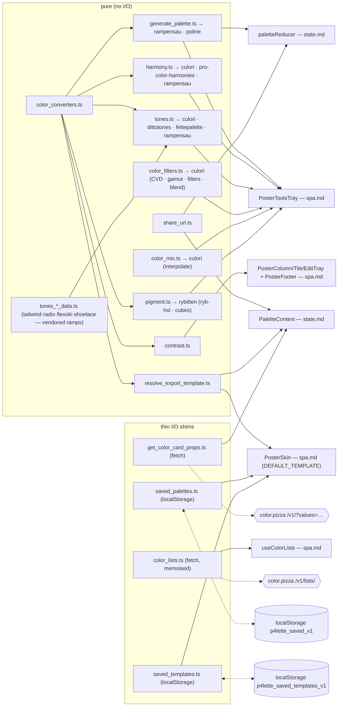

# SPEC · color — pure color & data functions

`src/functions/*` (excluding `*.test.ts`). No React, no JSX — pure functions plus three thin I/O shims (the two `color.pizza` clients and the localStorage stores). Color libraries used: `culori`, `pro-color-harmonies`, `rybitten`, `dittotones`, `rampensau`, `fettepalette`.

## Verbal outline

### `color_converters.ts` — pure (mostly hand-rolled; Okhsl via **`culori`** `okhsl`/`formatHex`)

- Hand-rolled space conversions: `clamp(v,lo,hi)`; `hexToRgb` (3- or 6-digit) / `rgbToHex` (round + pad); `rgbToHsl`/`hslToRgb`; `hexToHsl`/`hslToHex`; `rgbToHsv`/`hsvToRgb`; `hexToHsv`/`hsvToHex`; `rgbToOklch`/`oklchToRgb` (private sRGB↔OKLab matrices + `srgbToLinear`/`linearToSrgb`); `hexToOklch`/`oklchToHex`.
- `hexToOkhsl(hex) → {h:0–360, s:0–1, l:0–1}` / `okhslToHex({h,s,l})` — perceptually-even Okhsl (Björn Ottosson). Backed by `culori`'s `okhsl` converter + `formatHex` (the gamut-aware S normalisation is a footgun to hand-roll); `h` is `0` for achromatic colours; `s`/`l` clamped to `[0,1]`.
- `formatColor(hex, mode: ColorMode) → string` — exhaustive over `ColorMode`: `hex`→`#RRGGBB` uppercased; `rgb`→`rgb(r, g, b)`; `hsl`→`hsl(h, s%, l%)`; `hsv`→`hsv(h, s%, v%)`; `oklch`→`oklch(L%, c.3f, h.2f)`.
- `formatAll(hex) → { mode: ColorMode; label: string; value: string }[]` — the five `formatColor` outputs, **HEX first** (`label` = the mode uppercased) — for the `"all"` display MODE (`PosterColumn`/`PosterTile` stack them under the swatch).
- `parseColor(input, mode: ColorMode) → string | null` — `hex`: `/^#?([0-9a-f]{3}|[0-9a-f]{6})$/i` → normalised `#rrggbb`. `rgb`/`hsl`/`hsv`/`oklch`: pull ≥3 numbers via `extractNumbers`, **clamp** to range, convert to hex (oklch lightness `≤1` treated as 0..1 and ×100). `null` on empty/unparseable. **Quirk: out-of-range channels are clamped, not rejected** (`parseColor("rgb(999,0,0)","rgb") → "#ff0000"`).
- `randomHex() → string` — random HSL `h∈[0,360)`, `s∈[35,90]`, `l∈[30,80]` → `hslToHex` (avoids near-black/white/grey). The per-slot random used by `addColor` and as the `randomizeUnlocked` fallback.
- Consumers: `paletteReducer` (`randomHex`), `contrast.ts` (`hexToRgb`), `generate_palette.ts` (`hslToHex`), `harmony.ts` (`hexToHsl`, `hslToHex`), `tones.ts` (`clamp`, `hexToHsv`, `hsvToHex`), `resolve_export_template.ts` (`hexToRgb/Hsl/Hsv/Oklch`), `PosterColumn`/`PosterTile` (`formatColor`, `formatAll`), `PosterEditTray` (`formatColor`, `parseColor`, and `hexToOkhsl`/`okhslToHex` + `hexToHsl`/`hslToHex` + `hexToHsv`/`hsvToHex` + `hexToRgb`/`rgbToHex` + `hexToOklch`/`oklchToHex` — the EDIT-tray sliders run in the picked `editSpace`).

### `generate_palette.ts` — uses **`rampensau`** (`generateColorRamp`, `generateColorRampWithCurve`, `generateColorRampParams`) + **`poline`** (`Poline`)

- `GenStrategy = "default"|"rampensau"|"poline"|"random"`; `GEN_STRATEGIES` = `[{default,"DEFAULT"},{rampensau,"RAMPENSAU SWEEP"},{poline,"POLINE ANCHORS"},{random,"PLAIN RANDOM"}]` — `default` = the out-of-the-box `rampensau` sweep (random bounds; the GENERATE panel hides the tuning sliders for it); `rampensau` = the same sweep with the sliders exposed.
- `interface RampParams { sLo; sHi; lLo; lHi; hueSpan; curveAccent }` — the rampensau knobs the "tune the ramp" panel exposes (sat/light 0–1, `hueSpan` = |hCycles|, `curveAccent` shapes the lamé curve). `RAMP_PARAM_META: Record<keyof RampParams, {default,min,max,step}>` — lifted from rampensau's own `generateColorRampParams` (`minSaturation/maxSaturation/minLight/maxLight` → sLo/sHi/lLo/lHi; `hCycles` → hueSpan with `min:0`; `curveAccent`). `defaultRampParams()` → those defaults.
- **`generatePalette(count, strategy: GenStrategy = "default", rnd: () => number = Math.random, params?: RampParams): string[]`** — `count <= 0` → `[]`.
  - `"default"` / `"rampensau"` — `"default"` ≡ `"rampensau"` with no `params` (the out-of-the-box sweep; the panel hides the tuning sliders for it). No `params` → the random bounds (`sRange ≈ [0.4–0.6, 0.72–0.9]`, `lRange ≈ [0.18–0.3, 0.8–0.9]`, `hCycles = (0.2 + rnd()*0.8)·(±1)`) via `generateColorRamp`; with `params` (only ever via `"rampensau"`) → those bounds via `generateColorRampWithCurve({…, curveMethod:"lamé", curveAccent})`. Either way `hStart = rnd()*360`, `[h,s,l] → hslToHex({h, s:s*100, l:l*100})`. **A _coherent_ ramp (single hue arc, perceptual light→dark), not N randoms.**
  - `"poline"` — `new Poline({ numPoints: max(count,2), anchorColors: [a,b] })` with two `rnd`-derived anchors → `.colors` (`[h,s,l]`) → `hslToHex` → resampled to exactly `count` (private `resampleHexList` — evenly-spaced indices).
  - `"random"` — `count` independent `randomHex()` (the incoherent escape hatch).
  - Pass a deterministic `rnd` for reproducible `default`/`rampensau`/`poline`. Consumed by `paletteReducer` — the initial seed (`createPaletteState` — `genStrategy:"default"`) and `randomizeUnlocked` (`state.genStrategy`/`state.genParams`) — and by `PosterToolsTray` (`GenerateBody`: `generatePalette`, `GEN_STRATEGIES`, `GenStrategy`, `RAMP_PARAM_META`, `RampParams`, `defaultRampParams`).

### `harmony.ts` — uses **`culori`** (`clampChroma`, `formatHex`, `oklch`) + **`pro-color-harmonies`** (`ColorPaletteGenerator`, `PaletteStyle`) + **`rampensau`** (`colorUtils.colorHarmonies`)

- `HarmonyKind = "complementary"|"analogous"|"triadic"|"tetradic"|"split"|"monochrome"|"shades"`. Re-exports `PaletteStyle` (`'default'|'square'|'triangle'|'circle'|'diamond'`).
- `COUNTS: Record<HarmonyKind, number>` = `{ complementary:2, analogous:3, triadic:3, tetradic:4, split:3, monochrome:5, shades:3 }`. `harmony` always returns exactly `COUNTS[kind]` hexes (the style varies the hues, not the count). `harmonyHsv` returns one hex per hue the `colorHarmonies` fn yields.
- `HARMONY_STYLES: readonly PaletteStyle[]` = `["default","square","triangle","circle","diamond"]` — for the UI's style picker; `"default"` reproduces the prior behaviour.
- `HARMONY_HSV_KINDS: readonly { key: string; label: string }[]` — the rampensau HSV harmonies the UI offers as a third "space": `complementary, analogous, triadic, tetradic, splitComplementary, pentadic, hexadic, compound, doubleComplementary` (the last four are geometry pro-color-harmonies doesn't have).
- Private `LIB_KIND` maps `complementary/analogous/triadic/tetradic/split` → `pro-color-harmonies` kind names (`split → "splitComplementary"`); `monochrome`/`shades` deliberately not mapped (handled via `tintsShadesRamp`).
- Private helpers: `toHex(OKLCH)` → `formatHex(clampChroma({mode:"oklch",l,c,h},"oklch")) ?? "#000000"`. `dedupeByHue(colors, count)` — bucket by `Math.round(h)`, take up to `count` distinct hues, pad by cycling if short. `lightnessRamp(base, count, spread)` — evenly-spaced L over `[max(0.1, l-spread), min(0.95, l+spread)]`, holding `c`/`h`. `resampleRamp(ramp, count)` — lerp an OKLCH list to exactly `count` colours. `tintsShadesRamp(base, count, spread, style)` — `ColorPaletteGenerator.generate(base,"tintsShades",{style})` (the geometric style now applies — `default`/`square` hold the hue, the others bend hue/chroma a little), sorted by L, L-range remapped to `[max(0.1, l-spread), min(0.95, l+spread)]`, `resampleRamp`d to `count`; falls back to `lightnessRamp` if the lib returns <2.
- **`harmony(hex, kind, style: PaletteStyle = "default"): string[]`** — OKLCH path. `parsed = oklch(hex)`; null → `Array(COUNTS[kind]).fill(hex)`. `monochrome` → `tintsShadesRamp(base,5,0.32,style)`; `shades` → `tintsShadesRamp(base,3,0.22,style)` (style now affects these too). Else `ColorPaletteGenerator.generate(base, LIB_KIND[kind], { style })` → `dedupeByHue` to `COUNTS[kind]` → map `toHex`. (Hue varies per the harmony × `style`; the seed's L/C are roughly preserved.)
- **`harmonyHsv(hex, kindKey: string): string[]`** — rampensau HSV-space path. `fn = colorUtils.colorHarmonies[kindKey] ?? .complementary` (unknown → complementary); `{h,s,l} = hexToHsl(hex)`; `fn(h)` (a list of _absolute_ hues, the seed's first) → each `hslToHex({ h: hue mod 360, s, l })` (keeps the seed's HSL S/L — purely a hue-geometry variation).
- Consumed by `PosterToolsTray` (`HarmonyBody`: `harmony`, `harmonyHsv`, `HarmonyKind`, `PaletteStyle`, `HARMONY_STYLES`, `HARMONY_HSV_KINDS`).

### `tones.ts` — uses **`culori`** (`clampChroma`, `formatHex`, `oklch`, `parse`) + **`dittotones`** (`DittoTones`) + **`fettepalette`** (`generateRandomColorRamp`) + **`rampensau`** (`generateColorRamp`); reads `tones_{tailwind,radix,flexoki,shoelace}_data.ts`

- `STEPS = 11`. `ToneMethod = "ditto"|"oklch"|"hsv"|"gen"`. `interface ToneMethodInfo { id: ToneMethod; label: string; caption: string }`. `TONE_METHODS: readonly ToneMethodInfo[]` in row order: `ditto` ("DITTOTONES" / "perceptual scale blended from a reference ramp set"), `oklch` ("OKLCH RAMP" / "perceptually-even lightness; hue held, chroma bowed to the mids"), `hsv` ("HSV CURVE" / "curve through the HSV model via fettepalette — brighter mids"), `gen` ("GENERATIVE" / "single-hue sweep via rampensau — even hue, swept sat & lightness").
- Private `toHexOklch(l,c,h)` → `formatHex(clampChroma({mode:"oklch",l,c,h},"oklch")) ?? "#000000"`. Module-level: `buildRamps(raw)` → `Map<familyName, Record<step,{l,c,h}>>` by `culori`'s `oklch(parse(cssStr))` over a raw ramp map. `interface RampSet { key; label; ramps }`; `RAMP_SETS: readonly RampSet[]` — the DITTOTONES reference sets the TONES tool offers, **`TAILWIND v4` first (the default)** then `RADIX` / `FLEXOKI` / `SHOELACE`, each a vendored `tones_<set>_data.ts`. `DITTOS` = one `DittoTones({ ramps: buildRamps(s.ramps) as any, gamutMap: true })` per set; private `dittoFor(set)` → `DITTOS[set] ?? DITTOS.tailwind`.
- Four scalers (`(hex, …) → string[]`, lightest→darkest; the non-`ditto` ones are length `STEPS=11`, `ditto` is the reference ramp's shade count — Tailwind/Shoelace 11, Radix 12, Flexoki 13):
  - `dittoScale(hex, set="tailwind")` — `Object.values(dittoFor(set).generate(hex).scale)` mapped through `toHexOklch`, then **re-sorted by `oklch().l` descending** so it's always lightest→darkest regardless of the ramp's shade-key convention (Tailwind `50→950`, Shoelace `95→05`, …).
  - `oklchScale(hex)` — `oklch(hex)`; null → `Array(11).fill(hex)`. Even lightness `L ∈ [0.97, 0.13]`, hue held, chroma `baseC * (0.2 + 0.8*sin(πt))` (bell — full at the centre, 0.2× at the ends), via `toHexOklch`.
  - `fetteHsvScale(hex)` — `{h} = hexToHsv(hex)` → `generateRandomColorRamp({ total:5, centerHue:h, hueCycle:0, curveMethod:"lamé", curveAccent:0.2, offsetTint/Shade:0.05, tintShadeHueShift:0, minSaturationLight:[0.3,0.06], maxSaturationLight:[1,0.96], colorModel:"hsv" })`; takes `.all`'s value channel (clamped to `[0,1]`), sorts desc, resamples to 11, **stretches** the value range to `[0.99, 0.1]`; saturation bowed `100*(0.25 + 0.75*sin(πt))`; `hsvToHex`; finally re-sorts the 11 hexes by `oklch(.).l` desc to guarantee monotonic light→dark. (fettepalette supplies the curve shape; the range stretch makes the ramp always span; hue is held — `hueCycle:0`.)
  - `genScale(hex)` — `{h,s} = hexToHsl(hex)`; `sat = clamp(s/100, 0.15, 0.95)` → `generateColorRamp({ total:11, hStart:h, hCycles:0, sRange:[sat*0.55, sat], lRange:[0.12, 0.97] })` (single hue — `hCycles:0`); `[h,s,l] → hslToHex({h, s:s*100, l:l*100})`; re-sorted by `oklch(.).l` desc.
- `dittoMatch(hex, set="tailwind") → { shade: string; method: "exact"|"single"|"blend" }` — `dittoFor(set).generate(hex)`; `shade` = `${dominant source ramp}-${matchedShade}` (e.g. `"amber-700"` for tailwind, `"amber-8"` for radix; dominant = highest-weight `sources` entry), `method` straight from the result. Caption-only helper.
- `SCALERS: Record<ToneMethod, (hex)=>string[]>` = `{ ditto, oklch, hsv, gen }`; **`tones(hex, method, set="tailwind"): string[]` = `method==="ditto" ? dittoScale(hex,set) : SCALERS[method](hex)`** (the `set` arg is ignored by the non-`ditto` methods). Consumed by `PosterToolsTray` (`TonesBody`: `tones`, `TONE_METHODS`, `dittoMatch`, `RAMP_SETS`).

### `tones_{tailwind,radix,flexoki,shoelace}_data.ts` — pure data (vendored DITTOTONES reference ramps)

- `tailwindColors` — 22 Tailwind v4.1 families, each an 11-step `50`–`950` ramp of `oklch(...)` CSS strings.
- `radixColors` — the 31 chromatic Radix Colors v3 light scales (gray, mauve, slate, …, amber, orange), each a 12-step ramp keyed `"1"`–`"12"` (lightest→darkest) of `#rrggbb` hex.
- `flexokiColors` — the 8 chromatic Flexoki v1.0 hues (red, orange, yellow, green, cyan, blue, purple, magenta), each a 13-step `50`–`950` ramp (incl. `150`/`850`) of `#RRGGBB` hex.
- `shoelaceColors` — the 10 Shoelace / Web Awesome palette hues (red, orange, …, pink, gray), each an 11-step `95`–`05` ramp (lightest→darkest by key) of `oklch(...)` CSS strings.
- All are `Record<family, Record<shade, css-color>>` (any `culori.parse`-able string). Each header credits the source design system + `@meodai/dittoTones` (MIT) — the reference data was vendored from dittoTones's `src/ramps/raw/*` because the npm package ships only the engine. Used only by `tones.ts#RAMP_SETS` / `buildRamps`.

### `color_filters.ts` — uses **`culori`** (`filterDeficiency{Prot,Deuter,Trit}`, `filter{Grayscale,Sepia,Invert,Saturate,Contrast,HueRotate}`, `blend`, `toGamut`, `parse`, `formatHex`)

- `CvdType = "prot"|"deuter"|"trit"`. Private `mapHexes(hexes, fn)` — `parse` each hex, apply `fn`, `formatHex` back; falls back to the original string when parse/format misses. Private `identity(c)=c`.
- **`simulateCvd(hexes: string[], type: CvdType): string[]`** — runs each hex through culori's deficiency filter at full severity (`filterDeficiencyProt(1)` / `filterDeficiencyDeuter(1)` / `filterDeficiencyTrit(1)`). A non-destructive preview of how the palette reads to a colour-blind viewer.
- **`snapToGamut(hexes: string[]): string[]`** — module-level `intoSrgb = toGamut("rgb","oklch")`; reduces chroma in OKLCH until the colour is displayable, hue/lightness preserved. No-op on colours already in gamut → idempotent.
- `interface Effect { key; label }`; `EFFECTS: readonly Effect[]` = `[grayscale GRAYSCALE, sepia SEPIA, invert INVERT, saturate SATURATE+, desaturate DESATURATE, contrast CONTRAST+, hue-warm "HUE +30", hue-cool "HUE -30"]`; private `EFFECT_FNS: Record<key, (c)=>Color|undefined>` = `{grayscale: filterGrayscale(1), sepia: filterSepia(1), invert: filterInvert(1), saturate: filterSaturate(1.6), desaturate: filterSaturate(0.5), contrast: filterContrast(1.4), "hue-warm": filterHueRotate(30), "hue-cool": filterHueRotate(-30)}`.
- **`applyEffect(hexes: string[], key: string): string[]`** — `mapHexes(hexes, EFFECT_FNS[key] ?? identity)` (unknown key → input unchanged).
- `BlendMode = "multiply"|"screen"|"overlay"|"soft-light"|"hard-light"|"darken"|"lighten"|"difference"`; `BLEND_MODES: readonly BlendMode[]` = all of them.
- **`blendWith(hexes: string[], over: string, mode: BlendMode): string[]`** — `over` unparsable → input unchanged; else each `formatHex(blend([h, over], mode))` (composite `over` on top of the swatch).
- Consumed by `PosterToolsTray` (`FixersBody`: `CvdType`, `simulateCvd`, `snapToGamut`; `EffectsBody`: `EFFECTS`, `applyEffect`, `BLEND_MODES`, `BlendMode`, `blendWith`).

### `color_mix.ts` — uses **`culori`** (`interpolate`, `samples`, `parse`, `formatHex`)

- `MixSpace = "oklch"|"lab"|"hsl"`; `MIX_SPACES` = `[{oklch,OKLCH},{lab,LAB},{hsl,HSL}]`. `MIX_STEPS = [3,5,7,9,11]`. `MixCurve = "even"|"ease-from"|"ease-to"`; `MIX_CURVES` = `[{even,EVEN},{ease-from,EASE FROM},{ease-to,EASE TO}]`; private `GAMMA = { even:1, "ease-from":1.8, "ease-to":0.55 }` (γ on the sample parameter — `>1` bunches steps toward FROM, `<1` toward TO).
- **`mixSteps(a, b, n, space, curve): string[]`** — if either hex doesn't parse, fill `n` with the parsable one (or `#000000`). Else `itp = interpolate([a,b], space)` (culori's default hue fixup = shortest arc; `lab` has no hue), then `samples(n).map(t => formatHex(itp(t**GAMMA[curve])))`. Two stops → no polynomial spline; the curve just biases where the `n` samples land.
- Consumed by `PosterToolsTray` (`MixBody`: `MIX_SPACES`, `MIX_STEPS`, `MIX_CURVES`, `MixSpace`, `MixCurve`, `mixSteps`).

### `pigment.ts` — uses **`rybitten`** (`rybHsl2rgb`, `RYB_ITTEN`/`cubes` from `rybitten/cubes`) + `culori` `formatHex` + `color_converters` (`clamp`, `hexToHsl`)

- `interface PigmentCube { key; label; meta }` (`meta` = `"<author> · <year>"`). `PIGMENT_CUBES: readonly PigmentCube[]` — a curated slice of the ~34 rybitten cubes, chromatic wheels first (`itten` is rybitten's default and `PIGMENT_CUBES[0]`), the two reference cubes last: `itten, goethe, runge, chevreul, munsell, harris, boutet, cmy, rgb` (filtered to whatever keys `cubes` actually has). Private `cubeFor(key) = cubes.get(key)?.cube ?? RYB_ITTEN`; private `toHex([r,g,b]) = formatHex({mode:"rgb",...clamp 0–1}) ?? "#000000"`.
- **`pigmentFilter(hexes: string[], cubeKey: string): string[]`** — re-renders each swatch through the cube: `{h,s,l} = hexToHsl(hex)` → `rybHsl2rgb([h, s/100, l/100], { cube })` → `toHex`. The hue is read on the painter's wheel, lightness is preserved, chroma falls off the way that pigment system mixes. With the `rgb` cube ≈ near-identity; with `goethe`/`munsell`/… a print-like shift. The colour-as-pigment "filter" — what rybitten's profiles are for.
- **`pigmentWheel(cubeKey: string, n: number): string[]`** — `n` samples of `rybHsl2rgb([(i/n)*360, 1, 0.5], { cube })`: the cube's own colour wheel (full sat / mid lightness; visibly not an sRGB wheel).
- **`cubeCorners(cubeKey: string): string[]`** — the 8 corner colours of the cube as hex (white · red · yellow · orange · blue · violet · green · black).
- Consumed by `PosterToolsTray` (`PigmentBody`: `PIGMENT_CUBES`, `pigmentFilter`, `pigmentWheel`, `cubeCorners`).

### `contrast.ts` — pure, depends on `color_converters` only

- `luminance(hex) → number` (WCAG relative luminance). `contrast(a,b) → number` = `(hi+0.05)/(lo+0.05)`, symmetric. `fontColorFor(hex) → "#000000"|"#ffffff"` — whichever has higher contrast against `hex`. Consumed by `PosterColumn`/`PosterTile`/`PosterEditTray` (`fontColorFor`) and `PosterFooter` (`contrast` grade).

### `resolve_export_template.ts` — pure, depends on `color_converters` only

- `DEFAULT_TEMPLATE` — a multi-line demo string using `$1$`, `$1.hex$`, `$[1,3].name$`, `$[all].hex$`. Seeds the export sheet and is the `RESET` target; persisted to `p4lette_export_template_v1`.
- `EXPORT_PRESETS: readonly ExportPreset[]` (`ExportPreset = { key; label; body }`) — built-in starting templates the export sheet's `PRESETS ▾` offers: `CSS CUSTOM PROPERTIES`, `CSS OKLCH VARS`, `TAILWIND colors{}`, `JSON ARRAY`, `PLAIN HEX LIST`, `NAME — HEX`, `SWIFTUI COLORS`. The per-`--color-N` ones target the default 5-colour palette (the grammar has no loop, and a literal `$` collides with the `$…$` token syntax — so no Sass-map preset); the `$[all]…` ones adapt to any length.
- Private `ResolvedColor` = `{ name, hex, rgb:{r,g,b}, hsl:{h,s,l}, hsv:{h,s,v}, oklch:{l,c,h}, rgbCss, hslCss, oklchCss }` — rgb/hsl/hsv rounded to ints; oklch `l`/`h` to 1 dp, `c` to 3 dp; `rgbCss`/`hslCss`/`oklchCss` are CSS-ready value strings (`"r, g, b"` / `"h, s%, l%"` / `"l c h"` — for `rgb(…)`/`hsl(…)`/`oklch(…)`); `name` falls back to the hex when the names slot is empty. `fmt(v)` → `JSON.stringify(v)` if object, else `String(v)`.
- **`resolveTemplate(template, palette, names): string`** — replaces every `$...$` token (regex `/\$([^$]+)\$/g` — the inner expr cannot contain `$`):
  - **Array selector** `^\[([^\]]+)\](?:\.(\w+))?$`: `sel === "all"` → ids `1..n`; else `,`-split → `parseInt(trim,10)` → keep `Number.isFinite` → `colorAt`, drop nulls. None survive → `[ERROR: no ids in $...$]`. With `.prop` → `fmt(items.map(it => it[prop]))` (an unknown prop just yields `undefined`s — no error); without → `fmt(items)` (array of full objects).
  - **Single id** `^(\d+)(?:\.(\w+))?$`: `colorAt(id)`; null → `[ERROR: no color {id}]`. No prop → `fmt(it)`. Prop present but `it[prop] === undefined` → `[ERROR: no prop {prop}]`; else `fmt(it[prop])`.
  - Neither shape → `[ERROR: bad expr $...$]`. Any thrown error inside a token → `[ERROR: $...$]`.
- `colorAt(i)` is **1-based** (`palette[i-1]`). Single-id props: `name, hex, rgb, hsl, hsv, oklch, rgbCss, hslCss, oklchCss`. Consumed by `PaletteContext` (`resolveTemplate`, `DEFAULT_TEMPLATE`); `DEFAULT_TEMPLATE` also imported by `PosterSkin` (RESET), and `EXPORT_PRESETS` by `PosterExportSheet` (the `PRESETS ▾` dropdown).

### `share_url.ts` — pure

- `HEX_RE = /^#[0-9a-f]{6}$/i`. `encodePalette(palette): string` → `palette.map(c => c.hex.replace("#","")).join("-")` (e.g. `ff0000-00ff00-0000ff`; **6-digit only — assumes normalised hexes**). `decodePalette(raw): string[] | null` → strip a leading `#?p=`; `""` → null; split on `-`, drop empties, prefix `#`, **keep only `HEX_RE` matches**, lowercase; `null` if none survive. So a partly-garbage hash yields the valid subset; an all-garbage hash → `null`. Consumed by `PaletteContext` (`encodePalette` in the hash effect) and `paletteReducer` (`decodePalette` in `createPaletteState`).

### `get_color_card_props.ts` — `fetch`, no color lib

- `normalizeKey(hex)` → lowercase, no `#`. `DEFAULT_NAME_LIST = "bestOf"`. `interface GetColorNamesOptions { list?: string; fallbacks?: string[] }`. **`getColorNames(hexes: string[], options = {}): Promise<string[]>`** — `[]` for empty input; else `GET https://api.color.pizza/v1/?values=<csv>&noduplicates=true&list=<encodeURIComponent(list)>`; on `!res.ok` or thrown error → `hexes.map((_,i) => fallbacks?.[i] ?? hexes[i])`; on success → per slot `colors[i]?.name` if a non-empty string, else the per-slot fallback. **No caching — every call fetches.** Consumed by `PaletteContext` (names effect); `DEFAULT_NAME_LIST` also imported by `paletteReducer`.

### `color_lists.ts` — `fetch`, no color lib

- `interface ColorList { key: string; title: string }`. Module-level `cache: Promise<ColorList[]> | null`. `loadColorLists(): Promise<ColorList[]>` — memoises the fetch; nulls `cache` on rejection so a later call retries. `resetColorListsCache(): void`. Private `fetchLists()` → `GET https://api.color.pizza/v1/lists/`; throws on `!res.ok`; reads `availableColorNameLists` + `listDescriptions`; **filters out keys starting with `mlmc_`**; `title` falls back to the key. Consumed by `use_color_lists.ts`.

### `saved_palettes.ts` — `localStorage` only

- `SAVED_KEY = "p4lette_saved_v1"` (the **sole** owner of this key). `SAVED_LIMIT = 20`. `interface SavedPalette { id: string; name: string; hexes: string[]; createdAt: number }`. `defaultPaletteName(ms) → "palette-YYYY-MM-DD-HHmm"` (local time).
- Private `RawSavedPalette` (`name?: unknown`), `isValidEntry(entry)` type guard — needs string `id`, number `createdAt`, string-array `hexes`; **`name` not required**. `normalize(e)` — backfills `name` with `defaultPaletteName(createdAt)` when missing/blank/whitespace-only.
- `loadSaved(): SavedPalette[]` — read + `JSON.parse` `SAVED_KEY`; `[]` on missing/non-array/parse-error; `parsed.filter(isValidEntry).map(normalize)` — **this is the legacy-entry migration point** (older entries had no `name`). `persistSaved(list)` → `setItem(SAVED_KEY, JSON.stringify(list.slice(0, SAVED_LIMIT)))` (quota errors swallowed). `newSavedId() → string` (UUID or `${Date.now()}-${rand}`).
- Consumed by `PosterSkin` (`loadSaved`, `persistSaved`, `newSavedId`, `defaultPaletteName`, `SAVED_LIMIT`, `SavedPalette`) and `PosterSavedDrawer` (`SavedPalette` type).

### `saved_templates.ts` — `localStorage` only

- `SAVED_TEMPLATES_KEY = "p4lette_saved_templates_v1"` (sole owner). `SAVED_TEMPLATES_LIMIT = 20`. `interface SavedTemplate { id: string; name: string; body: string; createdAt: number }`. `isValidEntry` — needs string `id`/`name`/`body`, number `createdAt` (**stricter than `saved_palettes`; no normalization step**). `loadSavedTemplates()` (mirrors `loadSaved` minus `normalize`); `persistSavedTemplates(list)` (slice to limit); `newSavedTemplateId()`. Consumed by `PosterSkin` (`loadSavedTemplates`, `persistSavedTemplates`, `newSavedTemplateId`, `SAVED_TEMPLATES_LIMIT`, `SavedTemplate`) and `PosterExportSheet` (`SavedTemplate` type).

## JSON

```json
{
  "color_converters.ts": {
    "lib": "mostly hand-rolled; culori (okhsl, formatHex) for the Okhsl pair",
    "exports": [
      "clamp",
      "hexToRgb",
      "rgbToHex",
      "rgbToHsl",
      "hslToRgb",
      "hexToHsl",
      "hslToHex",
      "rgbToHsv",
      "hsvToRgb",
      "hexToHsv",
      "hsvToHex",
      "rgbToOklch",
      "oklchToRgb",
      "hexToOklch",
      "oklchToHex",
      "hexToOkhsl(hex)→{h:0–360,s:0–1,l:0–1} (culori; h=0 when achromatic; s/l clamped)",
      "okhslToHex({h,s,l})",
      "formatColor(hex,mode)",
      "formatAll(hex)→{mode,label,value}[] (the 5 formats, HEX first — for the 'all' display MODE)",
      "parseColor(input,mode)→string|null",
      "randomHex()"
    ],
    "quirks": [
      "parseColor clamps out-of-range channels rather than rejecting",
      "randomHex avoids near-black/white/grey"
    ]
  },
  "generate_palette.ts": {
    "lib": [
      "rampensau (generateColorRamp · generateColorRampWithCurve · generateColorRampParams)",
      "poline (Poline)"
    ],
    "GenStrategy": ["default", "rampensau", "poline", "random"],
    "RampParams": ["sLo", "sHi", "lLo", "lHi", "hueSpan", "curveAccent"],
    "exports": [
      "generatePalette(count, strategy='default', rnd=Math.random, params?)→string[] (count<=0→[]; default ≡ rampensau with no params = random bounds via generateColorRamp, the panel hides the sliders for it; rampensau with params → generateColorRampWithCurve(lamé,curveAccent); poline: 2 rnd-anchors → Poline → hslToHex → resample to count; random: N randomHex; COHERENT ramp not N randoms for default/rampensau/poline; deterministic with fixed rnd)",
      "GEN_STRATEGIES, GenStrategy, RampParams, RAMP_PARAM_META (= rampensau generateColorRampParams metadata), defaultRampParams()"
    ],
    "consumers": [
      "paletteReducer (seed + randomizeUnlocked, via state.genStrategy/genParams)",
      "PosterToolsTray (GenerateBody)"
    ]
  },
  "harmony.ts": {
    "lib": [
      "culori",
      "pro-color-harmonies",
      "rampensau (colorUtils.colorHarmonies)"
    ],
    "HarmonyKind": [
      "complementary",
      "analogous",
      "triadic",
      "tetradic",
      "split",
      "monochrome",
      "shades"
    ],
    "COUNTS": {
      "complementary": 2,
      "analogous": 3,
      "triadic": 3,
      "tetradic": 4,
      "split": 3,
      "monochrome": 5,
      "shades": 3
    },
    "HARMONY_STYLES": ["default", "square", "triangle", "circle", "diamond"],
    "HARMONY_HSV_KINDS": [
      "complementary",
      "analogous",
      "triadic",
      "tetradic",
      "splitComplementary",
      "pentadic",
      "hexadic",
      "compound",
      "doubleComplementary"
    ],
    "exports": [
      "harmony(hex,kind,style='default')→string[] (OKLCH path; mono/shades=tintsShadesRamp(base,n,spread,style) — style now applies; else ColorPaletteGenerator.generate(base,libKind,{style})+dedupeByHue+toHex)",
      "harmonyHsv(hex,kindKey)→string[] (rampensau colorUtils.colorHarmonies[kind] (unknown→complementary): seed hue → list of absolute hues → hslToHex keeping the seed's S/L)",
      "HarmonyKind",
      "PaletteStyle (re-exported)",
      "HARMONY_STYLES",
      "HARMONY_HSV_KINDS",
      "COUNTS"
    ],
    "private": [
      "resampleRamp(ramp,count) — lerp to count",
      "tintsShadesRamp(base,count,spread,style) — pro-color-harmonies tintsShades, L-range remapped, resampled; lightnessRamp fallback"
    ],
    "consumers": ["PosterToolsTray (HarmonyBody)"]
  },
  "tones.ts": {
    "lib": [
      "culori",
      "dittotones",
      "fettepalette",
      "rampensau (generateColorRamp)"
    ],
    "STEPS": 11,
    "ToneMethod": ["ditto", "oklch", "hsv", "gen"],
    "TONE_METHODS": "ordered [{ditto,DITTOTONES,'…reference ramp set'},{oklch,OKLCH RAMP,…},{hsv,HSV CURVE via fettepalette,…},{gen,GENERATIVE via rampensau,…}]",
    "RAMP_SETS": [
      "tailwind (TAILWIND v4 — default)",
      "radix (RADIX)",
      "flexoki (FLEXOKI)",
      "shoelace (SHOELACE)"
    ],
    "scalers": {
      "ditto": "dittoFor(set).generate(hex).scale → toHexOklch, re-sorted by oklch L desc; length = the set's shade count (tailwind/shoelace 11, radix 12, flexoki 13)",
      "oklch": "L 0.97→0.13 even, hue held, chroma baseC*(0.2+0.8sin(πt))",
      "hsv": "fettepalette generateRandomColorRamp (hueCycle:0, colorModel:hsv) → value channel resampled to 11, range stretched 0.99→0.1, sat bowed 0.25+0.75sin(πt); re-sorted by oklch L desc",
      "gen": "rampensau generateColorRamp({total:11, hStart:seedHue, hCycles:0, sRange:[sat*0.55,sat], lRange:[0.12,0.97]}) → hslToHex; re-sorted by oklch L desc"
    },
    "exports": [
      "tones(hex,method,set='tailwind')→string[] (ditto→dittoScale(hex,set); else SCALERS[method](hex))",
      "dittoScale(hex,set), dittoMatch(hex,set)→{shade:'<ramp>-<step>',method:'exact'|'single'|'blend'}",
      "TONE_METHODS, ToneMethod, RAMP_SETS, RampSet"
    ],
    "reads": [
      "tones_tailwind_data.ts",
      "tones_radix_data.ts",
      "tones_flexoki_data.ts",
      "tones_shoelace_data.ts"
    ],
    "consumers": [
      "PosterToolsTray (TonesBody — tones, TONE_METHODS, dittoMatch, RAMP_SETS)"
    ]
  },
  "tones_{tailwind,radix,flexoki,shoelace}_data.ts": {
    "lib": "none",
    "exports": [
      "tailwindColors: 22 families × 11 (oklch CSS strings)",
      "radixColors: 31 Radix v3 light scales × 12 (keys '1'–'12', #rrggbb)",
      "flexokiColors: 8 Flexoki hues × 13 (50–950 incl. 150/850, #RRGGBB)",
      "shoelaceColors: 10 Shoelace hues × 11 (keys 95–05, oklch CSS strings)"
    ],
    "note": "vendored DITTOTONES reference ramps (from @meodai/dittoTones src/ramps/raw — the npm package ships only the engine); Record<family, Record<shade, css-color>>",
    "consumers": ["tones.ts (RAMP_SETS / buildRamps)"]
  },
  "color_filters.ts": {
    "lib": "culori (filterDeficiency* · filter{Grayscale,Sepia,Invert,Saturate,Contrast,HueRotate} · blend · toGamut)",
    "CvdType": ["prot", "deuter", "trit"],
    "EFFECTS": [
      "grayscale",
      "sepia",
      "invert",
      "saturate",
      "desaturate",
      "contrast",
      "hue-warm",
      "hue-cool"
    ],
    "BlendMode": [
      "multiply",
      "screen",
      "overlay",
      "soft-light",
      "hard-light",
      "darken",
      "lighten",
      "difference"
    ],
    "exports": [
      "simulateCvd(hexes,type)→string[] (filterDeficiency* at severity 1; non-destructive preview)",
      "snapToGamut(hexes)→string[] (toGamut('rgb','oklch'); reduce chroma into sRGB, hue/L kept; no-op when in gamut → idempotent)",
      "EFFECTS, applyEffect(hexes,key)→string[] (mapHexes through EFFECT_FNS[key]: grayscale/sepia/invert(1), saturate(1.6)/desaturate(0.5), contrast(1.4), hueRotate(±30); unknown key → unchanged)",
      "BLEND_MODES, BlendMode, blendWith(hexes,over,mode)→string[] (blend([h,over],mode) per swatch; bad over → unchanged)"
    ],
    "consumers": ["PosterToolsTray (FixersBody · EffectsBody)"]
  },
  "color_mix.ts": {
    "lib": "culori (interpolate · samples)",
    "MixSpace": ["oklch", "lab", "hsl"],
    "MIX_STEPS": [3, 5, 7, 9, 11],
    "MixCurve": ["even", "ease-from", "ease-to"],
    "exports": [
      "MIX_SPACES, MIX_STEPS, MIX_CURVES, MixSpace, MixCurve",
      "mixSteps(a,b,n,space,curve)→string[] (bad hex → fill with the parsable one or #000000; else interpolate([a,b],space) — default shortest-arc hue fixup — sampled at t**γ where γ=GAMMA[curve]; 2-stop so the 'curve' just biases sample density)"
    ],
    "consumers": ["PosterToolsTray (MixBody)"]
  },
  "pigment.ts": {
    "lib": [
      "rybitten",
      "rybitten/cubes",
      "culori (formatHex)",
      "color_converters"
    ],
    "PIGMENT_CUBES": [
      "itten",
      "goethe",
      "runge",
      "chevreul",
      "munsell",
      "harris",
      "boutet",
      "cmy",
      "rgb"
    ],
    "exports": [
      "PigmentCube {key,label,meta='<author> · <year>'}",
      "PIGMENT_CUBES (curated slice of the ~34 rybitten cubes; itten=default & [0]; filtered to cubes.has)",
      "pigmentFilter(hexes,cubeKey)→string[] (per swatch: hexToHsl → rybHsl2rgb([h,s/100,l/100],{cube}) → hex; lightness kept, hue read on the painter's wheel, chroma falls off per that pigment system; rgb cube ≈ identity, goethe/munsell/… = print-like shift — the colour-as-pigment filter)",
      "pigmentWheel(cubeKey,n)→string[] (rybHsl2rgb([(i/n)*360,1,0.5],{cube}) — the cube's own colour wheel)",
      "cubeCorners(cubeKey)→string[] (the 8 corner colours: white·red·yellow·orange·blue·violet·green·black)"
    ],
    "consumers": ["PosterToolsTray (PigmentBody)"]
  },
  "contrast.ts": {
    "lib": "color_converters",
    "exports": [
      "luminance(hex)",
      "contrast(a,b) symmetric",
      "fontColorFor(hex)→#000|#fff"
    ],
    "consumers": [
      "PosterColumn",
      "PosterTile",
      "PosterEditTray",
      "PosterFooter"
    ]
  },
  "resolve_export_template.ts": {
    "lib": "color_converters",
    "exports": [
      "DEFAULT_TEMPLATE",
      "EXPORT_PRESETS, ExportPreset ({key,label,body}) — built-in starting templates for the PRESETS▾ dropdown (per---color-N ones are 5-slot; $[all]… ones adapt; no Sass-map preset — literal $ collides with $…$)",
      "resolveTemplate(template,palette,names)→string"
    ],
    "grammar": {
      "token": "$expr$ (expr has no $)",
      "array": "$[all].prop$ | $[1,3].prop$ (1-based, finite ints, nulls dropped; empty→[ERROR: no ids in $…$]; unknown prop→undefineds, no error)",
      "single": "$3$ (full obj) | $3.hex$ (name|hex|rgb|hsl|hsv|oklch|rgbCss|hslCss|oklchCss — *Css are CSS value strings); bad id→[ERROR: no color 3]; unknown prop→[ERROR: no prop X]",
      "else": "[ERROR: bad expr $…$]",
      "throw": "[ERROR: $…$]"
    },
    "consumers": [
      "PaletteContext (resolvedTemplate)",
      "PosterSkin (DEFAULT_TEMPLATE for RESET)",
      "PosterExportSheet (EXPORT_PRESETS for PRESETS▾)"
    ]
  },
  "share_url.ts": {
    "lib": "none",
    "exports": [
      "encodePalette(palette)→'rrggbb-rrggbb-…' (6-digit only)",
      "decodePalette(raw)→string[]|null (strips #?p=; keeps only /^#[0-9a-f]{6}$/i; null if none)"
    ],
    "consumers": [
      "PaletteContext (encode, hash effect)",
      "paletteReducer (decode, createPaletteState)"
    ]
  },
  "get_color_card_props.ts": {
    "lib": "fetch",
    "exports": [
      "DEFAULT_NAME_LIST='bestOf'",
      "getColorNames(hexes,opts?)→Promise<string[]>"
    ],
    "endpoint": "GET https://api.color.pizza/v1/?values=<csv>&noduplicates=true&list=<enc(list)>",
    "failure": "per-slot fallback to fallbacks[i] ?? hexes[i]; NO caching",
    "consumers": [
      "PaletteContext (names effect)",
      "paletteReducer (DEFAULT_NAME_LIST)"
    ]
  },
  "color_lists.ts": {
    "lib": "fetch",
    "exports": [
      "loadColorLists()→Promise<ColorList[]> (module-memoised; cache nulled on reject)",
      "resetColorListsCache()",
      "ColorList"
    ],
    "endpoint": "GET https://api.color.pizza/v1/lists/ (throws on !ok); filters keys starting mlmc_",
    "consumers": ["use_color_lists.ts"]
  },
  "saved_palettes.ts": {
    "lib": "localStorage",
    "key": "p4lette_saved_v1 (sole owner)",
    "limit": 20,
    "shape": "SavedPalette {id,name,hexes[],createdAt}",
    "exports": [
      "SAVED_KEY",
      "SAVED_LIMIT",
      "SavedPalette",
      "defaultPaletteName(ms)→'palette-YYYY-MM-DD-HHmm'",
      "loadSaved() (filters by isValidEntry, normalize backfills missing/blank name — legacy migration point)",
      "persistSaved(list) (slice to limit, quota-safe)",
      "newSavedId()"
    ],
    "consumers": ["PosterSkin", "PosterSavedDrawer"]
  },
  "saved_templates.ts": {
    "lib": "localStorage",
    "key": "p4lette_saved_templates_v1 (sole owner)",
    "limit": 20,
    "shape": "SavedTemplate {id,name,body,createdAt}",
    "exports": [
      "SAVED_TEMPLATES_KEY",
      "SAVED_TEMPLATES_LIMIT",
      "SavedTemplate",
      "loadSavedTemplates() (stricter validation, NO normalize)",
      "persistSavedTemplates(list)",
      "newSavedTemplateId()"
    ],
    "consumers": ["PosterSkin", "PosterExportSheet"]
  }
}
```

## Control-flow diagram


