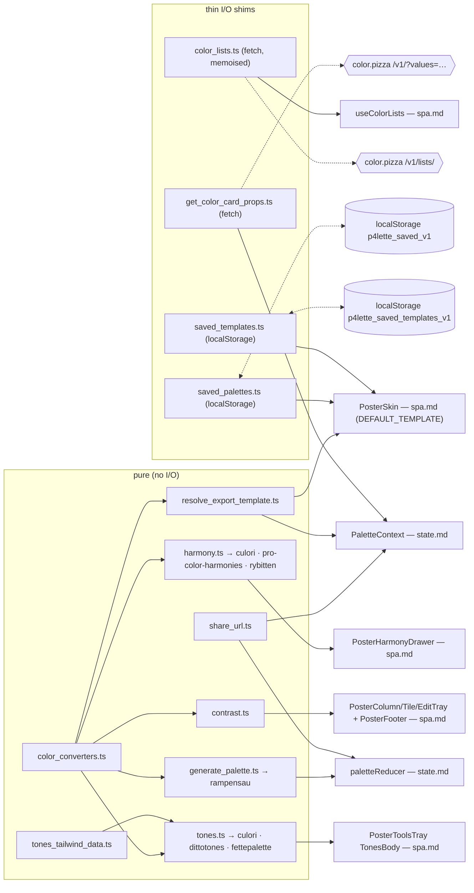

# SPEC · color — pure color & data functions

`src/functions/*` (excluding `*.test.ts`). No React, no JSX — pure functions plus three thin I/O shims (the two `color.pizza` clients and the localStorage stores). Color libraries used: `culori`, `pro-color-harmonies`, `rybitten`, `dittotones`, `rampensau`, `fettepalette`.

## Verbal outline

### `color_converters.ts` — pure, no external lib

- Hand-rolled space conversions: `clamp(v,lo,hi)`; `hexToRgb` (3- or 6-digit) / `rgbToHex` (round + pad); `rgbToHsl`/`hslToRgb`; `hexToHsl`/`hslToHex`; `rgbToHsv`/`hsvToRgb`; `hexToHsv`/`hsvToHex`; `rgbToOklch`/`oklchToRgb` (private sRGB↔OKLab matrices + `srgbToLinear`/`linearToSrgb`); `hexToOklch`/`oklchToHex`.
- `formatColor(hex, mode: ColorMode) → string` — exhaustive over `ColorMode`: `hex`→`#RRGGBB` uppercased; `rgb`→`rgb(r, g, b)`; `hsl`→`hsl(h, s%, l%)`; `hsv`→`hsv(h, s%, v%)`; `oklch`→`oklch(L%, c.3f, h.2f)`.
- `parseColor(input, mode: ColorMode) → string | null` — `hex`: `/^#?([0-9a-f]{3}|[0-9a-f]{6})$/i` → normalised `#rrggbb`. `rgb`/`hsl`/`hsv`/`oklch`: pull ≥3 numbers via `extractNumbers`, **clamp** to range, convert to hex (oklch lightness `≤1` treated as 0..1 and ×100). `null` on empty/unparseable. **Quirk: out-of-range channels are clamped, not rejected** (`parseColor("rgb(999,0,0)","rgb") → "#ff0000"`).
- `randomHex() → string` — random HSL `h∈[0,360)`, `s∈[35,90]`, `l∈[30,80]` → `hslToHex` (avoids near-black/white/grey). The per-slot random used by `addColor` and as the `randomizeUnlocked` fallback.
- Consumers: `paletteReducer` (`randomHex`), `contrast.ts` (`hexToRgb`), `generate_palette.ts` (`hslToHex`), `harmony.ts` (`clamp`, `hexToHsl`), `tones.ts` (`clamp`, `hexToHsv`, `hsvToHex`), `resolve_export_template.ts` (`hexToRgb/Hsl/Hsv/Oklch`), `PosterColumn`/`PosterTile`/`PosterEditTray` (`formatColor`, `parseColor`, `hexToHsl`, `hslToHex`).

### `generate_palette.ts` — uses **`rampensau`** `generateColorRamp`

- `generatePalette(count: number, rnd: () => number = Math.random): string[]`. `count <= 0` → `[]`. Randomises ramp params within tasteful bounds — `sRange ≈ [0.4–0.6, 0.72–0.9]`, `lRange ≈ [0.18–0.3, 0.8–0.9]`, `hStart = rnd()*360`, `hCycles = (0.2 + rnd()*0.8) * (rnd()<0.5 ? 1 : -1)` (a tight analogous sweep up to a full wheel; sign just reverses direction) — runs `generateColorRamp({ total: count, hStart, hCycles, sRange, lRange })`, maps `[h,s,l] → hslToHex({ h, s: s*100, l: l*100 })`. **Output is a _coherent_ ramp (single continuous hue arc, perceptual light→dark), not N independent randoms.** Pass a deterministic `rnd` for reproducibility. Consumed by `paletteReducer` — the initial seed (`createPaletteState`) and `randomizeUnlocked`.

### `harmony.ts` — uses **`culori`** (`clampChroma`, `formatHex`, `oklch`) + **`pro-color-harmonies`** (`ColorPaletteGenerator`) + **`rybitten`** (`rybHsl2rgb`)

- `HarmonyKind = "complementary"|"analogous"|"triadic"|"tetradic"|"split"|"monochrome"|"shades"`.
- `COUNTS: Record<HarmonyKind, number>` = `{ complementary:2, analogous:3, triadic:3, tetradic:4, split:3, monochrome:5, shades:3 }`.
- Private `LIB_KIND` maps `complementary/analogous/triadic/tetradic/split` → `pro-color-harmonies` kind names (`split → "splitComplementary"`); `monochrome`/`shades` deliberately not mapped (handled locally).
- Private helpers: `toHex(OKLCH)` → `formatHex(clampChroma({mode:"oklch",l,c,h},"oklch")) ?? "#000000"`. `dedupeByHue(colors, count)` — bucket by `Math.round(h)`, take up to `count` distinct hues, pad by cycling if short. `lightnessRamp(base, count, spread)` — evenly-spaced L over `[max(0.1, l-spread), min(0.95, l+spread)]`, holding `c`/`h`.
- **`harmony(hex, kind): string[]`** — OKLCH path. `parsed = oklch(hex)`; null → `Array(COUNTS[kind]).fill(hex)`. `monochrome` → `lightnessRamp(base,5,0.32)`; `shades` → `lightnessRamp(base,3,0.22)`. Else `ColorPaletteGenerator.generate(base, LIB_KIND[kind], {style:"default"})` → `dedupeByHue` to `COUNTS[kind]` → map `toHex`. (Hue varies per the harmony; the seed's L/C are roughly preserved.)
- `RYB_DELTAS: Partial<Record<HarmonyKind, readonly number[]>>` = `{ complementary:[0,180], analogous:[-30,0,30], triadic:[0,120,240], tetradic:[0,90,180,270], split:[0,150,210] }`.
- Private `rybHueRotate(hue, delta) → number | undefined` — rotate `hue` by `delta` on the **Itten/painter's wheel**: `rybHsl2rgb([((hue+delta)%360+360)%360, 1, 0.5])` (S=1, L=0.5 → the purest pigment for that angle), then `oklch({mode:"rgb",...clamped})?.h`. Returns **only the OKLCH hue** — the caller reapplies the seed's own L and C so results stay vivid/equiluminant rather than washing toward the cube's corners.
- **`harmonyRyb(hex, kind): string[]`** — RYB/Itten path. `monochrome`/`shades` delegate to `harmony`. Else: `deltas = RYB_DELTAS[kind]`; `parsed = oklch(hex)`; either missing → fill with `hex`. `seedHue = hexToHsl(hex).h`; `deltas.map(d => toHex({ l: parsed.l, c: parsed.c ?? 0, h: rybHueRotate(seedHue, d) ?? parsed.h }))`.
- Consumed by `PosterHarmonyDrawer` (`harmony`, `harmonyRyb`, `HarmonyKind`).

### `tones.ts` — uses **`culori`** (`clampChroma`, `formatHex`, `oklch`, `parse`) + **`dittotones`** (`DittoTones`) + **`fettepalette`** (`generateRandomColorRamp`); reads `tones_tailwind_data.ts`

- `STEPS = 11`. `ToneMethod = "ditto"|"oklch"|"hsv"`. `interface ToneMethodInfo { id: ToneMethod; label: string; caption: string }`. `TONE_METHODS: readonly ToneMethodInfo[]` in row order: `ditto` ("DITTOTONES" / "perceptual scale blended from Tailwind v4 reference ramps"), `oklch` ("OKLCH RAMP" / "perceptually-even lightness; hue held, chroma bowed to the mids"), `hsv` ("HSV CURVE" / "curve through the HSV model via fettepalette — brighter mids").
- Private `toHexOklch(l,c,h)` → `formatHex(clampChroma({mode:"oklch",l,c,h},"oklch")) ?? "#000000"`. Module-level: `buildRamps()` → `Map<familyName, Record<step,{l,c,h}>>` by `culori`'s `oklch(parse(cssStr))` over every entry in `tailwindColors`; `dt = new DittoTones({ ramps: buildRamps() as any, gamutMap: true })`.
- Three scalers (`(hex) → string[]`, length 11, lightest→darkest):
  - `dittoScale(hex)` — `Object.entries(dt.generate(hex).scale)` sorted by numeric Tailwind shade key (`50…950`), mapped through `toHexOklch`.
  - `oklchScale(hex)` — `oklch(hex)`; null → `Array(11).fill(hex)`. Even lightness `L ∈ [0.97, 0.13]`, hue held, chroma `baseC * (0.2 + 0.8*sin(πt))` (bell — full at the centre, 0.2× at the ends), via `toHexOklch`.
  - `fetteHsvScale(hex)` — `{h} = hexToHsv(hex)` → `generateRandomColorRamp({ total:5, centerHue:h, hueCycle:0, curveMethod:"lamé", curveAccent:0.2, offsetTint/Shade:0.05, tintShadeHueShift:0, minSaturationLight:[0.3,0.06], maxSaturationLight:[1,0.96], colorModel:"hsv" })`; takes `.all`'s value channel (clamped to `[0,1]`), sorts desc, resamples to 11, **stretches** the value range to `[0.99, 0.1]`; saturation bowed `100*(0.25 + 0.75*sin(πt))`; `hsvToHex`; finally re-sorts the 11 hexes by `oklch(.).l` desc to guarantee monotonic light→dark. (fettepalette supplies the curve shape; the range stretch makes the ramp always span; hue is held — `hueCycle:0`.)
- `dittoMatch(hex) → { shade: string; method: "exact"|"single"|"blend" }` — `dt.generate(hex)`; `shade` = `${dominant source ramp}-${matchedShade}` (e.g. `"amber-700"`; dominant = highest-weight `sources` entry), `method` straight from the result. Caption-only helper.
- `SCALERS: Record<ToneMethod, fn>`; **`tones(hex: string, method: ToneMethod): string[]` = `SCALERS[method](hex)`**. Consumed by `PosterToolsTray` (`TonesBody`: `tones`, `TONE_METHODS`, `dittoMatch`).

### `tones_tailwind_data.ts` — pure data

- `tailwindColors: Record<string, Record<string, string>>` — 22 Tailwind v4.1 families (slate, gray, zinc, neutral, stone, red, orange, amber, yellow, lime, green, emerald, teal, cyan, sky, blue, indigo, violet, purple, fuchsia, pink, rose), each an 11-step `50`–`950` ramp of `oklch(...)` CSS strings. Header comment credits Tailwind (MIT) / `@meodai/dittoTones` (MIT). Used only by `tones.ts#buildRamps`.

### `contrast.ts` — pure, depends on `color_converters` only

- `luminance(hex) → number` (WCAG relative luminance). `contrast(a,b) → number` = `(hi+0.05)/(lo+0.05)`, symmetric. `fontColorFor(hex) → "#000000"|"#ffffff"` — whichever has higher contrast against `hex`. Consumed by `PosterColumn`/`PosterTile`/`PosterEditTray` (`fontColorFor`) and `PosterFooter` (`contrast` grade).

### `resolve_export_template.ts` — pure, depends on `color_converters` only

- `DEFAULT_TEMPLATE` — a multi-line demo string using `$1$`, `$1.hex$`, `$[1,3].name$`, `$[all].hex$`. Seeds the export sheet and is the `RESET` target; persisted to `p4lette_export_template_v1`.
- Private `ResolvedColor` = `{ name, hex, rgb:{r,g,b}, hsl:{h,s,l}, hsv:{h,s,v}, oklch:{l,c,h} }` — rgb/hsl/hsv rounded to ints; oklch `l`/`h` to 1 dp, `c` to 3 dp; `name` falls back to the hex when the names slot is empty. `fmt(v)` → `JSON.stringify(v)` if object, else `String(v)`.
- **`resolveTemplate(template, palette, names): string`** — replaces every `$...$` token (regex `/\$([^$]+)\$/g` — the inner expr cannot contain `$`):
  - **Array selector** `^\[([^\]]+)\](?:\.(\w+))?$`: `sel === "all"` → ids `1..n`; else `,`-split → `parseInt(trim,10)` → keep `Number.isFinite` → `colorAt`, drop nulls. None survive → `[ERROR: no ids in $...$]`. With `.prop` → `fmt(items.map(it => it[prop]))` (an unknown prop just yields `undefined`s — no error); without → `fmt(items)` (array of full objects).
  - **Single id** `^(\d+)(?:\.(\w+))?$`: `colorAt(id)`; null → `[ERROR: no color {id}]`. No prop → `fmt(it)`. Prop present but `it[prop] === undefined` → `[ERROR: no prop {prop}]`; else `fmt(it[prop])`.
  - Neither shape → `[ERROR: bad expr $...$]`. Any thrown error inside a token → `[ERROR: $...$]`.
- `colorAt(i)` is **1-based** (`palette[i-1]`). Single-id props: `name, hex, rgb, hsl, hsv, oklch`. Consumed by `PaletteContext` (`resolveTemplate`, `DEFAULT_TEMPLATE`); `DEFAULT_TEMPLATE` also imported by `PosterSkin` (RESET).

### `share_url.ts` — pure

- `HEX_RE = /^#[0-9a-f]{6}$/i`. `encodePalette(palette): string` → `palette.map(c => c.hex.replace("#","")).join("-")` (e.g. `ff0000-00ff00-0000ff`; **6-digit only — assumes normalised hexes**). `decodePalette(raw): string[] | null` → strip a leading `#?p=`; `""` → null; split on `-`, drop empties, prefix `#`, **keep only `HEX_RE` matches**, lowercase; `null` if none survive. So a partly-garbage hash yields the valid subset; an all-garbage hash → `null`. Consumed by `PaletteContext` (`encodePalette` in the hash effect) and `paletteReducer` (`decodePalette` in `createPaletteState`).

### `get_color_card_props.ts` — `fetch`, no color lib

- `normalizeKey(hex)` → lowercase, no `#`. `DEFAULT_NAME_LIST = "bestOf"`. `interface GetColorNamesOptions { list?: string; fallbacks?: string[] }`. **`getColorNames(hexes: string[], options = {}): Promise<string[]>`** — `[]` for empty input; else `GET https://api.color.pizza/v1/?values=<csv>&noduplicates=true&list=<encodeURIComponent(list)>`; on `!res.ok` or thrown error → `hexes.map((_,i) => fallbacks?.[i] ?? hexes[i])`; on success → per slot `colors[i]?.name` if a non-empty string, else the per-slot fallback. **No caching — every call fetches.** Consumed by `PaletteContext` (names effect); `DEFAULT_NAME_LIST` also imported by `paletteReducer`.

### `color_lists.ts` — `fetch`, no color lib

- `interface ColorList { key: string; title: string }`. Module-level `cache: Promise<ColorList[]> | null`. `loadColorLists(): Promise<ColorList[]>` — memoises the fetch; nulls `cache` on rejection so a later call retries. `resetColorListsCache(): void`. Private `fetchLists()` → `GET https://api.color.pizza/v1/lists/`; throws on `!res.ok`; reads `availableColorNameLists` + `listDescriptions`; **filters out keys starting with `mlmc_`**; `title` falls back to the key. Consumed by `use_color_lists.ts`.

### `saved_palettes.ts` — `localStorage` only

- `SAVED_KEY = "p4lette_saved_v1"` (the **sole** owner of this key). `SAVED_LIMIT = 20`. `interface SavedPalette { id: string; name: string; hexes: string[]; createdAt: number }`. `defaultPaletteName(ms) → "palette-YYYY-MM-DD-HHmm"` (local time).
- Private `RawSavedPalette` (`name?: unknown`), `isValidEntry(entry)` type guard — needs string `id`, number `createdAt`, string-array `hexes`; **`name` not required**. `normalize(e)` — backfills `name` with `defaultPaletteName(createdAt)` when missing/blank/whitespace-only.
- `loadSaved(): SavedPalette[]` — read + `JSON.parse` `SAVED_KEY`; `[]` on missing/non-array/parse-error; `parsed.filter(isValidEntry).map(normalize)` — **this is the legacy-entry migration point** (older entries had no `name`). `persistSaved(list)` → `setItem(SAVED_KEY, JSON.stringify(list.slice(0, SAVED_LIMIT)))` (quota errors swallowed). `newSavedId() → string` (UUID or `${Date.now()}-${rand}`).
- Consumed by `PosterSkin` (`loadSaved`, `persistSaved`, `newSavedId`, `defaultPaletteName`, `SAVED_LIMIT`, `SavedPalette`) and `PosterSavedDrawer` (`SavedPalette` type).

### `saved_templates.ts` — `localStorage` only

- `SAVED_TEMPLATES_KEY = "p4lette_saved_templates_v1"` (sole owner). `SAVED_TEMPLATES_LIMIT = 20`. `interface SavedTemplate { id: string; name: string; body: string; createdAt: number }`. `isValidEntry` — needs string `id`/`name`/`body`, number `createdAt` (**stricter than `saved_palettes`; no normalization step**). `loadSavedTemplates()` (mirrors `loadSaved` minus `normalize`); `persistSavedTemplates(list)` (slice to limit); `newSavedTemplateId()`. Consumed by `PosterSkin` (`loadSavedTemplates`, `persistSavedTemplates`, `newSavedTemplateId`, `SAVED_TEMPLATES_LIMIT`, `SavedTemplate`) and `PosterExportSheet` (`SavedTemplate` type).

## JSON

```json
{
  "color_converters.ts": {
    "lib": "none (hand-rolled)",
    "exports": [
      "clamp",
      "hexToRgb",
      "rgbToHex",
      "rgbToHsl",
      "hslToRgb",
      "hexToHsl",
      "hslToHex",
      "rgbToHsv",
      "hsvToRgb",
      "hexToHsv",
      "hsvToHex",
      "rgbToOklch",
      "oklchToRgb",
      "hexToOklch",
      "oklchToHex",
      "formatColor(hex,mode)",
      "parseColor(input,mode)→string|null",
      "randomHex()"
    ],
    "quirks": [
      "parseColor clamps out-of-range channels rather than rejecting",
      "randomHex avoids near-black/white/grey"
    ]
  },
  "generate_palette.ts": {
    "lib": "rampensau",
    "exports": ["generatePalette(count, rnd=Math.random)→string[]"],
    "behaviour": "count<=0→[]; randomised ramp params (sRange/lRange/hStart/hCycles±) → generateColorRamp → hslToHex; COHERENT ramp not N randoms; deterministic with fixed rnd",
    "consumers": ["paletteReducer (seed + randomizeUnlocked)"]
  },
  "harmony.ts": {
    "lib": ["culori", "pro-color-harmonies", "rybitten"],
    "HarmonyKind": [
      "complementary",
      "analogous",
      "triadic",
      "tetradic",
      "split",
      "monochrome",
      "shades"
    ],
    "COUNTS": {
      "complementary": 2,
      "analogous": 3,
      "triadic": 3,
      "tetradic": 4,
      "split": 3,
      "monochrome": 5,
      "shades": 3
    },
    "exports": [
      "harmony(hex,kind)→string[] (OKLCH path; mono/shades=lightnessRamp; else ColorPaletteGenerator+dedupeByHue+toHex)",
      "harmonyRyb(hex,kind)→string[] (RYB path; mono/shades delegate; else rotate seedHue by RYB_DELTAS on the Itten wheel via rybHueRotate, reapply seed L/C)",
      "HarmonyKind",
      "COUNTS"
    ],
    "RYB_DELTAS": {
      "complementary": [0, 180],
      "analogous": [-30, 0, 30],
      "triadic": [0, 120, 240],
      "tetradic": [0, 90, 180, 270],
      "split": [0, 150, 210]
    },
    "consumers": ["PosterHarmonyDrawer"]
  },
  "tones.ts": {
    "lib": ["culori", "dittotones", "fettepalette"],
    "STEPS": 11,
    "ToneMethod": ["ditto", "oklch", "hsv"],
    "TONE_METHODS": "ordered [{ditto,DITTOTONES,…},{oklch,OKLCH RAMP,…},{hsv,HSV CURVE via fettepalette,…}]",
    "scalers": {
      "ditto": "dt.generate(hex).scale sorted 50→950 → toHexOklch",
      "oklch": "L 0.97→0.13 even, hue held, chroma baseC*(0.2+0.8sin(πt))",
      "hsv": "fettepalette generateRandomColorRamp (hueCycle:0, colorModel:hsv) → value channel resampled to 11, range stretched 0.99→0.1, sat bowed 0.25+0.75sin(πt); re-sorted by oklch L desc"
    },
    "exports": [
      "tones(hex,method)→string[]",
      "dittoMatch(hex)→{shade:'<ramp>-<step>',method:'exact'|'single'|'blend'}",
      "TONE_METHODS",
      "ToneMethod"
    ],
    "reads": "tones_tailwind_data.ts",
    "consumers": ["PosterToolsTray (TonesBody)"]
  },
  "tones_tailwind_data.ts": {
    "lib": "none",
    "exports": [
      "tailwindColors: 22 families × 11 steps of oklch(...) CSS strings"
    ],
    "consumers": ["tones.ts"]
  },
  "contrast.ts": {
    "lib": "color_converters",
    "exports": [
      "luminance(hex)",
      "contrast(a,b) symmetric",
      "fontColorFor(hex)→#000|#fff"
    ],
    "consumers": [
      "PosterColumn",
      "PosterTile",
      "PosterEditTray",
      "PosterFooter"
    ]
  },
  "resolve_export_template.ts": {
    "lib": "color_converters",
    "exports": [
      "DEFAULT_TEMPLATE",
      "resolveTemplate(template,palette,names)→string"
    ],
    "grammar": {
      "token": "$expr$ (expr has no $)",
      "array": "$[all].prop$ | $[1,3].prop$ (1-based, finite ints, nulls dropped; empty→[ERROR: no ids in $…$]; unknown prop→undefineds, no error)",
      "single": "$3$ (full obj) | $3.hex$ (name|hex|rgb|hsl|hsv|oklch); bad id→[ERROR: no color 3]; unknown prop→[ERROR: no prop X]",
      "else": "[ERROR: bad expr $…$]",
      "throw": "[ERROR: $…$]"
    },
    "consumers": [
      "PaletteContext (resolvedTemplate)",
      "PosterSkin (DEFAULT_TEMPLATE for RESET)"
    ]
  },
  "share_url.ts": {
    "lib": "none",
    "exports": [
      "encodePalette(palette)→'rrggbb-rrggbb-…' (6-digit only)",
      "decodePalette(raw)→string[]|null (strips #?p=; keeps only /^#[0-9a-f]{6}$/i; null if none)"
    ],
    "consumers": [
      "PaletteContext (encode, hash effect)",
      "paletteReducer (decode, createPaletteState)"
    ]
  },
  "get_color_card_props.ts": {
    "lib": "fetch",
    "exports": [
      "DEFAULT_NAME_LIST='bestOf'",
      "getColorNames(hexes,opts?)→Promise<string[]>"
    ],
    "endpoint": "GET https://api.color.pizza/v1/?values=<csv>&noduplicates=true&list=<enc(list)>",
    "failure": "per-slot fallback to fallbacks[i] ?? hexes[i]; NO caching",
    "consumers": [
      "PaletteContext (names effect)",
      "paletteReducer (DEFAULT_NAME_LIST)"
    ]
  },
  "color_lists.ts": {
    "lib": "fetch",
    "exports": [
      "loadColorLists()→Promise<ColorList[]> (module-memoised; cache nulled on reject)",
      "resetColorListsCache()",
      "ColorList"
    ],
    "endpoint": "GET https://api.color.pizza/v1/lists/ (throws on !ok); filters keys starting mlmc_",
    "consumers": ["use_color_lists.ts"]
  },
  "saved_palettes.ts": {
    "lib": "localStorage",
    "key": "p4lette_saved_v1 (sole owner)",
    "limit": 20,
    "shape": "SavedPalette {id,name,hexes[],createdAt}",
    "exports": [
      "SAVED_KEY",
      "SAVED_LIMIT",
      "SavedPalette",
      "defaultPaletteName(ms)→'palette-YYYY-MM-DD-HHmm'",
      "loadSaved() (filters by isValidEntry, normalize backfills missing/blank name — legacy migration point)",
      "persistSaved(list) (slice to limit, quota-safe)",
      "newSavedId()"
    ],
    "consumers": ["PosterSkin", "PosterSavedDrawer"]
  },
  "saved_templates.ts": {
    "lib": "localStorage",
    "key": "p4lette_saved_templates_v1 (sole owner)",
    "limit": 20,
    "shape": "SavedTemplate {id,name,body,createdAt}",
    "exports": [
      "SAVED_TEMPLATES_KEY",
      "SAVED_TEMPLATES_LIMIT",
      "SavedTemplate",
      "loadSavedTemplates() (stricter validation, NO normalize)",
      "persistSavedTemplates(list)",
      "newSavedTemplateId()"
    ],
    "consumers": ["PosterSkin", "PosterExportSheet"]
  }
}
```

## Control-flow diagram


