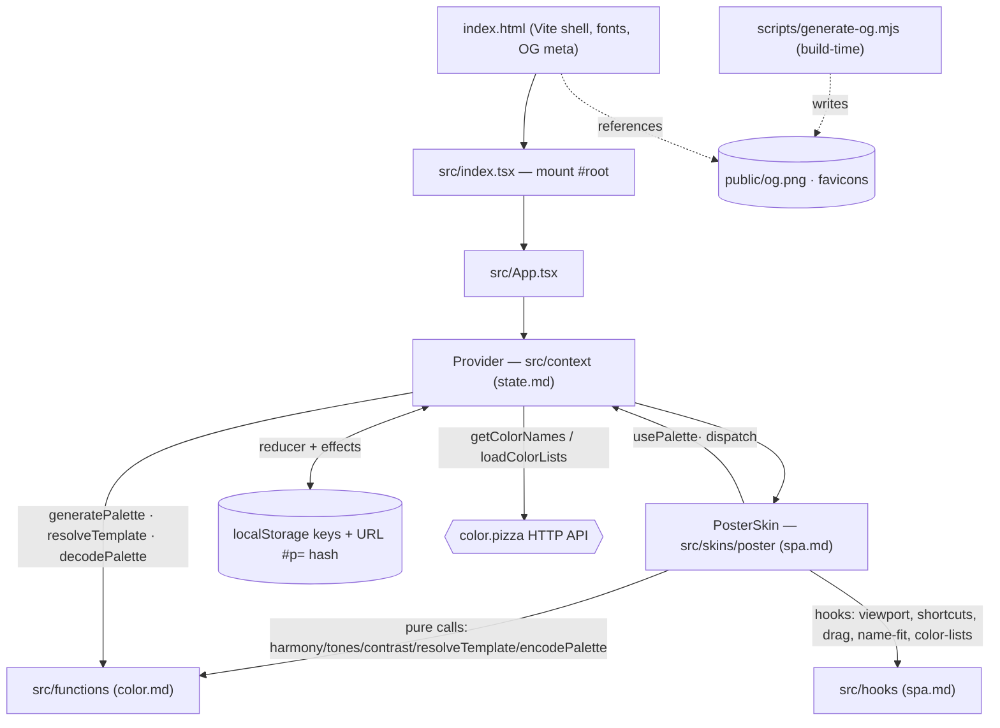

# SPEC · index — p4lette

Entry point for the SPEC. Repo-at-a-glance, layout, persistence surfaces, cross-cutting guardrails. Per-subsystem detail lives in the sibling files; each is self-contained.

## Verbal outline

- **What it is** — `p4lette`: a one-page color-palette tool. Make N colors, edit/lock/reorder/shuffle them, name them via an external API, copy them out through a user-editable export template. No accounts, no backend, no router. React 18 + Vite 8 + TypeScript 6; package manager **npm** (`package-lock.json`).
- **App tree** — `src/index.tsx` mounts `<App/>` into `#root` (throws `"no root element"` if absent). `src/App.tsx` = `<Provider><PosterSkin/></Provider>` — that's the whole app. `Provider` (`src/context/PaletteContext.tsx`) owns all palette state; `PosterSkin` (`src/skins/poster/PosterSkin.tsx`) is the only UI surface.
- **Layout → subsystem map**:
  - `src/context/*` + `src/types/*` → **`state.md`** — the reducer, the provider, the shared types.
  - `src/functions/*` (pure color/data logic; no React) → **`color.md`** — converters, harmony, tones, contrast, generation, export-template resolver, share-URL codec, localStorage stores, color.pizza clients.
  - `src/skins/poster/*` + `src/hooks/*` + `src/App.tsx` + `src/index.tsx` → **`spa.md`** — every component, the overlay/edit state in `PosterSkin`, the hooks.
  - `*.test.ts(x)` (colocated next to source) + `src/setupTests.ts` + Vitest config → **`testing.md`**.
  - this file → **`index.md`** — plus `index.html` (Vite shell), `scripts/generate-og.mjs` (build-time favicon/OG generator), `public/*` (generated assets), root config (`vite.config.ts`, `tsconfig.json`, `eslint.config.mjs`, `package.json`).
- **Persistence surfaces** — see table below. Two kinds: **localStorage** (8 keys, `v1`-suffixed) and the **URL hash** (`#p=<hex>-<hex>-…`, 6-digit hexes, no `#` per color; written debounced 150 ms via `history.replaceState`; cleared to bare path when the palette is empty; read once at startup to seed state). Every localStorage/`window`/`crypto`/`navigator` access is `typeof`-guarded + wrapped in try/catch (SSR- and private-mode-safe; quota errors swallowed).
- **External HTTP dependency** — `color.pizza`, no auth, no key, fail-soft:
  - `GET https://api.color.pizza/v1/?values=<csv-hex>&noduplicates=true&list=<list>` → color names — `src/functions/get_color_card_props.ts`. On any failure: per-slot fallback to the previous name, else the hex.
  - `GET https://api.color.pizza/v1/lists/` → available name-list keys — `src/functions/color_lists.ts` (module-memoised). On failure: a "load failed" UI state.
- **Color libraries** (all under `src/functions/`): `culori` (OKLCH/space math, filters, blend, interpolate — harmony, tones, color_filters, color_mix), `pro-color-harmonies` (`ColorPaletteGenerator` — OKLCH harmony sets incl. `tintsShades`), `rybitten` (`rybHsl2rgb`/`ryb2rgb` + `cubes` — the PIGMENT cube filter: each swatch re-mixed through a painter's pigment wheel, plus the wheel's own colours and its corners), `dittotones` (`DittoTones` — perceptual tone scales from vendored reference ramp sets: Tailwind v4 (default), Radix, Flexoki, Shoelace), `rampensau` (`generateColorRamp` + `colorUtils.colorHarmonies` — coherent palette generation for the seed + SHUFFLE, the GENERATIVE tone method, HSV harmonies), `fettepalette` (`generateRandomColorRamp` — the HSV-curve tone scale), `poline` (`Poline` — the POLINE ANCHORS palette-generation strategy).
- **Commands** — `npm run dev` (=`vite`), `npm run build` (=`tsc --noEmit && vite build` → `dist/`), `npm run preview`, `npm test` (=`vitest run`), `npm run test:watch`, `npm run typecheck` (=`tsc --noEmit`), `npm run lint` (=`eslint .`), `npm run og` (=`node scripts/generate-og.mjs` → regenerates `public/og.png`, `favicon.svg`, `favicon-32.png`, `apple-touch-icon.png`).
- **Cross-cutting guardrails / known state**:
  - **Lint debt**: `src/skins/poster/PosterEditTray.tsx` raises `react-hooks/set-state-in-effect` — the `setInput(formatColor(hex, textMode))` effect that re-syncs the text field on a colour/space change (currently ≈L145). `npm run lint` therefore exits non-zero with exactly this one error — any "lint must be clean" check has to allow it (or the file gets fixed).
  - `react-refresh/only-export-components` is intentionally **off** for `src/context/**` (that module exports `Provider`, `PaletteContext`, `usePalette` + re-exports together).
  - **Tests are colocated** (`src/**/X.test.ts(x)`), not in a `tests/`/`__tests__/` mirror tree. This is the project rule and deliberately overrides the general "tests in mirror modules" convention.
  - `tsconfig.json`: `strict`, `noEmit`, `noFallthroughCasesInSwitch` (reducer/`formatColor`/`parseColor` switches are exhaustive, no `default`), `isolatedModules`, `moduleResolution: "bundler"`, `jsx: "react-jsx"`, `types: ["vite/client"]`. `package.json` `overrides` pins `@types/react`/`@types/react-dom` to `^18.3.x` so React-18 typings survive newer tooling.
  - **Branching**: feature branches off `dev`; PRs target `dev`. Conventional commits. (The GitHub default branch differs — releasing `dev` onward is the maintainer's call.)
  - **Vestigial / unused** (don't mistake for live surface): there was a "terminal" skin once — it's gone (no `src/` code, and `scripts/generate-og.mjs` no longer draws it; only stale README copy still mentions it). `src/types/Colors.ts` exports `Colors`/`ColorProperty` that nothing imports. `useViewport().isLandscape` has no consumer. `exportVisible` / `setExportVisible` exist on the context but `PosterSkin` manages export visibility with its own local `showExport`.
  - `build/`, `handoff/`, `scripts/.fonts/` are gitignored local artifacts, not source.
- **SPEC workflow** — opening a plan: write the post-plan state into `SPEC/TARGET/<subsystem>.md` first. Shipping it: sync `SPEC/CURRENT/<subsystem>.md` to match `TARGET/` **in the same commit as the implementation**. Divergence between the trees = work in flight. `.claude/.spec-enabled` (empty marker) opts this repo into the convention. **Adding / renaming / removing a TOOLS-tray tool** is one line in `src/skins/poster/tools/index.ts` (`TRAY_SECTIONS`) — and in SPEC, one new bullet + one new key in `spa.md`'s `PosterToolsTray.sections`, plus (if a new `functions/*` module backs it) one new `<module> --> ttray` edge in `color.md` and a `Consumed by PosterToolsTray (XBody: …)` line in that module's section. Keep symbol-level imports in the `functions/*` "Consumed by" lines — don't re-enumerate them in the `PosterToolsTray` bullet (that was the recurring merge-conflict magnet).

### Persistence surfaces

| Surface      | Key / format                         | Owner (sole writer)                                                             | Holds                                                                          |
| ------------ | ------------------------------------ | ------------------------------------------------------------------------------- | ------------------------------------------------------------------------------ |
| localStorage | `p4lette_export_template_v1`         | `src/context/PaletteContext.tsx`                                                | export-template string (effect on change)                                      |
| localStorage | `p4lette_name_list_v1`               | `src/context/PaletteContext.tsx`                                                | active color.pizza list key                                                    |
| localStorage | `p4lette_color_mode_v1`              | `src/context/PaletteContext.tsx`                                                | `DisplayMode` incl. `all` — **default `all`**; validated against `VALID_MODES` |
| localStorage | `p4lette_edit_space_v1`              | `src/context/PaletteContext.tsx`                                                | `EditSpace` — the EDIT tray's editing space; **default `okhsl`**; validated    |
| localStorage | `p4lette_saved_v1`                   | `src/functions/saved_palettes.ts`                                               | JSON `SavedPalette[]`, capped `SAVED_LIMIT=20`                                 |
| localStorage | `p4lette_saved_templates_v1`         | `src/functions/saved_templates.ts`                                              | JSON `SavedTemplate[]`, capped `SAVED_TEMPLATES_LIMIT=20`                      |
| localStorage | `p4lette_seen_welcome_v1`            | `src/skins/poster/PosterSkin.tsx`                                               | `"1"` once the welcome modal is dismissed                                      |
| localStorage | `p4lette_ticker_v1`                  | `src/skins/poster/PosterSkin.tsx`                                               | `"0"`/`"1"` ticker visibility — off by default, visible only if `"1"`          |
| URL hash     | `#p=<hex>-<hex>-…` (6-digit, no `#`) | `src/context/PaletteContext.tsx` (write) / `src/functions/share_url.ts` (codec) | the live palette; debounced 150 ms; seeds startup state via `decodePalette`    |

## JSON

```json
{
  "repo": "p4lette",
  "kind": "single-page React app, no backend/router",
  "stack": {
    "ui": "React 18",
    "build": "Vite 8",
    "lang": "TypeScript 6",
    "pm": "npm",
    "test": "Vitest 4 (jsdom)"
  },
  "entry": {
    "dom": "src/index.tsx",
    "tree": "src/App.tsx = <Provider><PosterSkin/></Provider>",
    "html": "index.html"
  },
  "subsystems": {
    "index.md": [
      "index.html",
      "scripts/generate-og.mjs",
      "public/*",
      "vite.config.ts",
      "tsconfig.json",
      "eslint.config.mjs",
      "package.json"
    ],
    "state.md": ["src/context/*", "src/types/*"],
    "color.md": ["src/functions/* (excl. *.test.ts)"],
    "spa.md": [
      "src/skins/poster/*",
      "src/hooks/*",
      "src/App.tsx",
      "src/index.tsx"
    ],
    "testing.md": [
      "src/**/*.test.ts(x)",
      "src/setupTests.ts",
      "vite.config.ts#test"
    ]
  },
  "colorLibs": {
    "culori": "OKLCH/space math, filters, blend, interpolate (harmony.ts, tones.ts, color_filters.ts, color_mix.ts)",
    "pro-color-harmonies": "ColorPaletteGenerator — OKLCH harmony sets incl. tintsShades (harmony.ts)",
    "rybitten": "rybHsl2rgb / ryb2rgb + cubes — the PIGMENT cube filter / wheel / corners (pigment.ts)",
    "dittotones": "DittoTones — perceptual tone scales from vendored reference ramps: Tailwind v4 / Radix / Flexoki / Shoelace (tones.ts, tones_*_data.ts)",
    "rampensau": "generateColorRamp + colorUtils.colorHarmonies — palette generation, GENERATIVE tones, HSV harmonies (generate_palette.ts, tones.ts, harmony.ts)",
    "fettepalette": "generateRandomColorRamp — HSV-curve tone scale (tones.ts)",
    "poline": "Poline — POLINE ANCHORS generation strategy (generate_palette.ts)"
  },
  "persistence": {
    "localStorage": {
      "p4lette_export_template_v1": "src/context/PaletteContext.tsx",
      "p4lette_name_list_v1": "src/context/PaletteContext.tsx",
      "p4lette_color_mode_v1": "src/context/PaletteContext.tsx (DisplayMode incl. 'all' — default 'all')",
      "p4lette_edit_space_v1": "src/context/PaletteContext.tsx (EditSpace — EDIT tray; default 'okhsl')",
      "p4lette_saved_v1": "src/functions/saved_palettes.ts (cap 20)",
      "p4lette_saved_templates_v1": "src/functions/saved_templates.ts (cap 20)",
      "p4lette_seen_welcome_v1": "src/skins/poster/PosterSkin.tsx",
      "p4lette_ticker_v1": "src/skins/poster/PosterSkin.tsx"
    },
    "urlHash": {
      "format": "#p=<rrggbb>-<rrggbb>-...",
      "write": "PaletteContext (replaceState, 150ms debounce, cleared when empty)",
      "codec": "src/functions/share_url.ts",
      "seedsStartup": true
    },
    "safety": "all localStorage/window/crypto/navigator access typeof-guarded + try/catch"
  },
  "externalHttp": {
    "color.pizza": {
      "names": "GET https://api.color.pizza/v1/?values=<csv>&noduplicates=true&list=<list> — get_color_card_props.ts, fallback to prev name/hex",
      "lists": "GET https://api.color.pizza/v1/lists/ — color_lists.ts, module-memoised, 'load failed' UI on error",
      "auth": "none"
    }
  },
  "commands": {
    "dev": "vite",
    "build": "tsc --noEmit && vite build",
    "preview": "vite preview",
    "test": "vitest run",
    "test:watch": "vitest",
    "typecheck": "tsc --noEmit",
    "lint": "eslint .",
    "og": "node scripts/generate-og.mjs"
  },
  "guardrails": {
    "lintDebt": "src/skins/poster/PosterEditTray.tsx react-hooks/set-state-in-effect (the setInput-on-space/colour-change effect, ~L145) — `eslint .` exits non-zero with this one error",
    "reactRefreshOffFor": "src/context/**",
    "testsColocated": "src/**/X.test.ts(x) — overrides the 'mirror modules' convention",
    "branching": "feature branches off dev; PRs target dev; conventional commits",
    "vestigial": [
      "terminal skin — removed (no src/ code; OG script no longer draws it; README copy stale)",
      "src/types/Colors.ts Colors/ColorProperty unused",
      "useViewport().isLandscape unused",
      "context exportVisible/setExportVisible unused by UI"
    ],
    "gitignoredArtifacts": [
      "build/",
      "dist/",
      "handoff/",
      "scripts/.fonts/",
      "coverage/"
    ]
  },
  "specWorkflow": {
    "openPlan": "write SPEC/TARGET/<subsystem>.md",
    "ship": "sync SPEC/CURRENT/<subsystem>.md in the same commit",
    "enableMarker": ".claude/.spec-enabled"
  }
}
```

## Control-flow diagram


