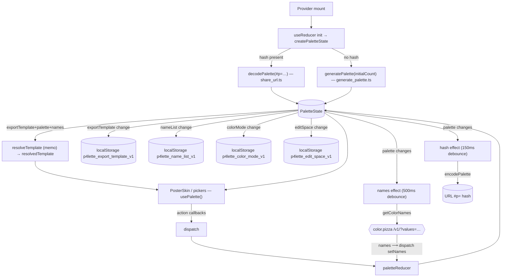

# SPEC · state — palette reducer + context

`src/context/paletteReducer.ts` (the pure reducer + `createPaletteState`), `src/context/PaletteContext.tsx` (the React provider, effects, action callbacks, `usePalette`), and the shared types in `src/types/*`. This is the single source of truth for palette data; view state (overlays, editing, theme) lives in `PosterSkin` — see `spa.md`.

## Verbal outline

### Types (`src/types/*`)

- `ColorCardProps.ts` — `interface ColorCardProps { id: number; hex: string; locked: boolean; dataId: string }`. `id` = 0-based array index, **kept in sync with position via `renumber`** (so `id` is a positional handle, not a stable identity). `dataId` = stable UUID, used as the React key (survives shuffle/reorder).
- `Palette.ts` — `type Palette = ColorCardProps[]`.
- `Colors.ts` — `type HexColor = string`; `RGBColor={r,g,b}`; `HSLColor={h,s,l}`; `HSVColor={h,s,v}`; `OKLCHColor={l,c,h}`; **`ColorMode = "hex"|"rgb"|"hsl"|"hsv"|"oklch"`** (the five formats); **`DisplayMode = ColorMode | "all"`** (what the footer MODE picker offers / `colorMode` stores — `"all"` = every format stacked under each swatch, the default); **`EditSpace = "okhsl"|"rgb"|"hsl"|"hsv"|"oklch"`** (the inline EDIT tray's editing space — text input + the three sliders); `ColorProperty`, `Colors` — exported but unused anywhere in `src/` (vestigial).
- `PaletteContextProps.ts` — what `usePalette()` returns: data `{ palette: Palette; names: string[]; exportVisible: boolean; exportTemplate: string; resolvedTemplate: string; nameList: string; colorMode: DisplayMode; editSpace: EditSpace; genStrategy: GenStrategy; genParams: RampParams | null }` + actions `addColor(hex?), insertColor(index,hex), deleteColor(id), updateColor(id,hex), reorderColor(from,to), toggleLock(id), randomizeUnlocked(), replaceAll(hexes), setExportTemplate(t), setExportVisible(v), setNameList(list), setColorMode(mode), setEditSpace(space), setGenConfig({strategy?, params?})`. (`exportVisible`/`setExportVisible` exist but the UI ignores them — `PosterSkin` owns `showExport` locally. `GenStrategy`/`RampParams` are from `../functions/generate_palette`.)

### Reducer (`src/context/paletteReducer.ts`)

- **`PaletteState`** = `{ palette: Palette; names: string[]; exportVisible: boolean; exportTemplate: string; nameList: string; colorMode: DisplayMode; editSpace: EditSpace; genStrategy: GenStrategy; genParams: RampParams | null }`. `palette[i]` and `names[i]` are positionally paired; `names[i]` is `"..."` (`NAME_PLACEHOLDER`) until resolved by the names effect. `colorMode` (under-swatch display, `"all"` by default) and `editSpace` (EDIT-tray editing space, `"okhsl"` by default) persist to localStorage; `genStrategy`/`genParams` drive SHUFFLE + the seed — session-only (not persisted).
- Helpers: `NAME_PLACEHOLDER = "..."`. `newDataId(id)` → `crypto.randomUUID()` else `${Date.now()}-${id}-${rand}`. `makeColor(hex, id)` → `{ id, hex, locked: false, dataId: newDataId(id) }`. `renumber(palette)` → `palette.map((c,i) => ({...c, id:i}))` — resyncs `id` to index after any structural change. `reorderItems<T>(items, from, to)` → array move; no-op if `from===to` or either index is out of range.
- **`createPaletteState({ initialCount=5, exportTemplate, hash=null, nameList=DEFAULT_NAME_LIST, colorMode="all", editSpace="okhsl" })`** → `decoded = decodePalette(hash)`; `seed = decoded ?? generatePalette(initialCount)` (strategy `"default"` = the random-bounds rampensau sweep); returns `{ palette: seed.map(makeColor), names: seed.map(()=> "..."), exportVisible:false, exportTemplate, nameList, colorMode, editSpace, genStrategy:"default", genParams:null }`. **The URL hash wins; otherwise a fresh _coherent_ random ramp of `initialCount` colors** (`generatePalette`, not per-slot random — see `color.md`). `initialCount:0` is the test seam (empty palette).
- **`paletteReducer(state, action)`** — exhaustive switch (`noFallthroughCasesInSwitch`, no `default`):
  - `addColor{hex?}` — `hex ?? randomHex()`; append `makeColor(hex, palette.length)`, then `renumber`; append `"..."` to `names`. _(The one place a brand-new color is per-slot-random rather than from a coherent ramp.)_
  - `insertColor{index,hex}` — clamp `index` to `[0, palette.length]`; splice `makeColor(hex, index)` in at that position, then `renumber`; splice `"..."` into `names` at the same position. The caller passes the exact hex — the strip's `+` affordance computes the OKLab midpoint with a neighbour / an end-extrapolation (see `spa.md`).
  - `deleteColor{id}` — find by `id`; not found → return `state`. Else `renumber(palette.filter(out i))` + `names.filter(out i)`.
  - `updateColor{id,hex}` — find by `id`; not found → return `state`. Else swap that slot's `hex` (keep `id`/`locked`/`dataId`); **reset `names[i]` to `"..."`** (forces a re-fetch for the changed color).
  - `reorderColor{fromIndex,toIndex}` — `renumber(reorderItems(palette, from, to))` + `reorderItems(names, from, to)` — palette and names move **together**; ids resync to new positions.
  - `toggleLock{id}` — `palette.map(c => c.id===id ? {...c, locked:!c.locked} : c)`. Names untouched.
  - `randomizeUnlocked` — `fresh = generatePalette(palette.length, state.genStrategy, Math.random, state.genParams ?? undefined)` (**one coherent palette** via the chosen strategy/params — see `color.md`). For each slot `i`: `c.locked` → keep `c` verbatim; else `{...c, hex: fresh[i] ?? randomHex()}`. Names: locked slots keep `state.names[i] ?? "..."`, unlocked → `"..."`. **`dataId` preserved for every slot** (React keys stay stable through shuffle). Lock semantics: a locked color's hex _and_ name persist; everything else re-rolls from the new palette **at the same index** so the set still reads as a whole.
  - `replaceAll{hexes}` — `hexes.map(makeColor)` (fresh ids `0..n-1`, fresh `dataId`s, `locked:false`) + `names = hexes.map(()=> "...")`. Used by saved-palette load, harmony apply, tones apply.
  - `setNames{names}` — `names = palette.map((_,i) => action.names[i] ?? state.names[i] ?? "...")` — **padded/truncated to the current palette length**, falling back to the existing name then the placeholder. A stale async response that's a different length than the live palette therefore can't corrupt the array.
  - `setExportTemplate{template}` — `{...state, exportTemplate}`.
  - `setExportVisible{visible}` — `{...state, exportVisible}`.
  - `setNameList{list}` — if `list === state.nameList` → return `state` (same ref). Else `{...state, nameList, names: palette.map(()=> "...")}` — **clears every name** so the old list's names can't leak as fallbacks for the new list.
  - `setColorMode{mode}` — if `mode === state.colorMode` → return `state` (same ref). Else `{...state, colorMode}`.
  - `setEditSpace{space}` — if `space === state.editSpace` → return `state` (same ref). Else `{...state, editSpace}`.
  - `setGenConfig{strategy?, params?}` — `{...state, genStrategy: strategy ?? state.genStrategy, genParams: params === undefined ? state.genParams : params}`. So `params:undefined` leaves them as-is, `params:null` clears them (used when switching to a non-rampensau strategy), a `RampParams` sets them. Dispatched by the GENERATE panel's USE.

### Provider (`src/context/PaletteContext.tsx`)

- Constants: `EXPORT_KEY="p4lette_export_template_v1"`, `NAME_LIST_KEY="p4lette_name_list_v1"`, `COLOR_MODE_KEY="p4lette_color_mode_v1"`, `EDIT_SPACE_KEY="p4lette_edit_space_v1"`, `NAMES_DEBOUNCE_MS=500`, `HASH_DEBOUNCE_MS=150`, `NAME_PLACEHOLDER="..."`, `VALID_MODES=["hex","rgb","hsl","hsv","oklch","all"] as const`, `VALID_EDIT_SPACES=["okhsl","rgb","hsl","hsv","oklch"] as const`.
- `PaletteContext = createContext<PaletteContextProps | undefined>(undefined)`. `usePalette()` → `useContext`; throws `"usePalette must be used within Provider"` if undefined.
- Local readers (try/catch + `typeof` guards): `readInitialTemplate()` → `localStorage[EXPORT_KEY] ?? DEFAULT_TEMPLATE`; `readInitialNameList()` → `localStorage[NAME_LIST_KEY] ?? DEFAULT_NAME_LIST`; `readInitialColorMode()` → `localStorage[COLOR_MODE_KEY]` validated against `VALID_MODES`, else `"all"`; `readInitialEditSpace()` → `localStorage[EDIT_SPACE_KEY]` validated against `VALID_EDIT_SPACES`, else `"okhsl"`; `readInitialHash()` → `window.location.hash || null`.
- **`Provider({ children, initialState? })`**:
  - `useReducer(paletteReducer, undefined, () => initialState ?? createPaletteState({ exportTemplate: readInitialTemplate(), hash: readInitialHash(), nameList: readInitialNameList(), colorMode: readInitialColorMode(), editSpace: readInitialEditSpace() }))`. `initialState` is the **test seam** (`PaletteContext.test.tsx`).
  - `namesRef = useRef(names)` kept current by an effect.
  - `resolvedTemplate = useMemo(() => resolveTemplate(exportTemplate, palette, names), [exportTemplate, palette, names])`.
  - **Names effect** (deps `[palette, nameList]`): if `palette.length===0` → dispatch `setNames []` and return. Else `setTimeout(NAMES_DEBOUNCE_MS=500)`: build per-slot `fallbacks` (current name if set & ≠`"..."`, else hex), `await getColorNames(palette.map(c=>c.hex), { list: nameList, fallbacks })`, dispatch `setNames` if still `alive`. Cleanup clears the timeout + flips `alive`. _(Depends on `palette` array identity, so any reducer change that yields a new array re-triggers a 500 ms-debounced re-fetch.)_
  - **Hash effect** (deps `[palette]`): `setTimeout(HASH_DEBOUNCE_MS=150)`: `enc = encodePalette(palette)`; `target = enc ? "#p="+enc : ""`; if `location.hash !== target`, `history.replaceState(null, "", target || pathname+search)`.
  - **Four persistence effects**: write `EXPORT_KEY` / `NAME_LIST_KEY` / `COLOR_MODE_KEY` / `EDIT_SPACE_KEY` whenever `exportTemplate` / `nameList` / `colorMode` / `editSpace` change (try/catch; quota errors ignored).
  - Action callbacks — each a `useCallback([])` dispatching the matching action: `addColor, insertColor, deleteColor, updateColor, reorderColor, toggleLock, randomizeUnlocked, replaceAll, setExportTemplate, setExportVisible, setNameList, setColorMode, setEditSpace, setGenConfig`.
  - `itf = useMemo<PaletteContextProps>(() => ({ palette, names, exportVisible, exportTemplate, resolvedTemplate, nameList, colorMode, editSpace, genStrategy, genParams, ...callbacks }), [...])`; renders `<PaletteContext.Provider value={itf}>{children}</PaletteContext.Provider>`.
- Imports & re-uses `PaletteState, createPaletteState, paletteReducer` from `./paletteReducer`; `DEFAULT_TEMPLATE`/`resolveTemplate` from `../functions/resolve_export_template`; `getColorNames`/`DEFAULT_NAME_LIST` from `../functions/get_color_card_props`; `encodePalette` from `../functions/share_url`.

## JSON

```json
{
  "types": {
    "ColorCardProps": "{ id:number(=array index, via renumber); hex:string; locked:boolean; dataId:string(=stable UUID, React key) }",
    "Palette": "ColorCardProps[]",
    "ColorMode": "\"hex\"|\"rgb\"|\"hsl\"|\"hsv\"|\"oklch\"",
    "DisplayMode": "ColorMode | \"all\" — what the footer MODE picker offers / colorMode stores; 'all' = every format stacked, the default",
    "EditSpace": "\"okhsl\"|\"rgb\"|\"hsl\"|\"hsv\"|\"oklch\" — the EDIT tray's editing space (text input + 3 sliders); default 'okhsl'",
    "PaletteContextProps": {
      "data": [
        "palette",
        "names",
        "exportVisible(unused by UI)",
        "exportTemplate",
        "resolvedTemplate",
        "nameList",
        "colorMode (DisplayMode)",
        "editSpace (EditSpace)",
        "genStrategy",
        "genParams (RampParams|null)"
      ],
      "actions": [
        "addColor(hex?)",
        "insertColor(index,hex)",
        "deleteColor(id)",
        "updateColor(id,hex)",
        "reorderColor(from,to)",
        "toggleLock(id)",
        "randomizeUnlocked()",
        "replaceAll(hexes)",
        "setExportTemplate(t)",
        "setExportVisible(v)",
        "setNameList(list)",
        "setColorMode(mode)",
        "setEditSpace(space)",
        "setGenConfig({strategy?, params?})"
      ]
    },
    "vestigial": ["Colors", "ColorProperty"]
  },
  "PaletteState": "{ palette:Palette; names:string[](paired by index, '...' until resolved); exportVisible:boolean; exportTemplate:string; nameList:string; colorMode:DisplayMode; editSpace:EditSpace; genStrategy:GenStrategy; genParams:RampParams|null (session-only — not in hash/localStorage) }",
  "helpers": {
    "NAME_PLACEHOLDER": "...",
    "makeColor": "{id, hex, locked:false, dataId:newDataId}",
    "newDataId": "crypto.randomUUID() | `${Date.now()}-${id}-${rand}`",
    "renumber": "id := array index",
    "reorderItems": "array move; no-op on equal/oob"
  },
  "createPaletteState": {
    "args": "{initialCount=5, exportTemplate, hash=null, nameList=DEFAULT_NAME_LIST, colorMode='all', editSpace='okhsl'}",
    "seed": "decodePalette(hash) ?? generatePalette(initialCount)",
    "note": "URL hash wins; else a coherent random ramp; colorMode:'all', editSpace:'okhsl', genStrategy:'default', genParams:null; initialCount:0 = test seam"
  },
  "actions": {
    "addColor": "append makeColor(hex??randomHex()), renumber; names += '...' — ONLY per-slot-random new color",
    "insertColor": "clamp index to [0,len]; splice makeColor(hex,index), renumber; splice '...' into names — caller passes the exact hex (the strip + affordance: OKLab midpoint with a neighbour / end-extrapolation)",
    "deleteColor": "find by id (no-op if absent); renumber(filter) + names.filter",
    "updateColor": "find by id (no-op if absent); swap hex (keep id/locked/dataId); names[i] := '...'",
    "reorderColor": "renumber(reorderItems(palette)) + reorderItems(names) — move together",
    "toggleLock": "flip locked on matching id; names untouched",
    "randomizeUnlocked": "fresh = generatePalette(len, state.genStrategy, Math.random, state.genParams ?? undefined); slot i: locked→verbatim, else {...c, hex:fresh[i]??randomHex()}; names: locked keep, else '...'; dataId preserved all slots",
    "replaceAll": "hexes.map(makeColor) (fresh ids/dataIds, locked:false) + names all '...'",
    "setNames": "names := palette.map((_,i)=> action.names[i] ?? state.names[i] ?? '...') — length-clamped to palette",
    "setExportTemplate": "{...state, exportTemplate}",
    "setExportVisible": "{...state, exportVisible}",
    "setNameList": "no-op (same ref) if unchanged; else {...state, nameList, names: all '...'}",
    "setColorMode": "no-op (same ref) if unchanged; else {...state, colorMode}",
    "setEditSpace": "no-op (same ref) if unchanged; else {...state, editSpace}",
    "setGenConfig": "{...state, genStrategy: strategy ?? prev, genParams: params===undefined ? prev : params (null clears)}"
  },
  "provider": {
    "init": "useReducer(paletteReducer, undefined, () => initialState ?? createPaletteState({ exportTemplate:readInitialTemplate(), hash:readInitialHash(), nameList:readInitialNameList(), colorMode:readInitialColorMode(), editSpace:readInitialEditSpace() }))",
    "testSeam": "initialState prop",
    "memo": "resolvedTemplate = useMemo(resolveTemplate(exportTemplate, palette, names), [exportTemplate,palette,names])",
    "effects": {
      "names": "deps [palette,nameList]; empty palette→setNames []; else setTimeout 500ms → getColorNames(hexes,{list,fallbacks}) → setNames if alive",
      "hash": "deps [palette]; setTimeout 150ms → replaceState(encodePalette(palette) ? '#p='+enc : pathname+search)",
      "persist": "exportTemplate→EXPORT_KEY, nameList→NAME_LIST_KEY, colorMode→COLOR_MODE_KEY, editSpace→EDIT_SPACE_KEY (try/catch)"
    },
    "callbacks": "each useCallback([]) dispatching its action",
    "throws": "usePalette outside Provider → Error"
  },
  "consumers": "PosterSkin (everything) + PosterColumn/PosterTile (colorMode) + PosterEditTray (editSpace + setEditSpace) + PosterModePicker (colorMode + setColorMode) + PosterNamingPicker/PosterNamingSheet (nameList + setNameList) + PosterToolsTray GenerateBody (genStrategy/genParams + setGenConfig)"
}
```

## Control-flow diagram


