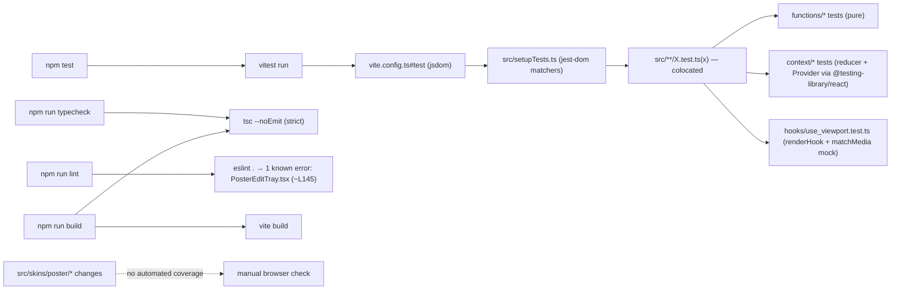

# SPEC · testing

The test setup, the colocation rule, the commands, and a per-file map of what's covered. Tests are run by **Vitest 4** under **jsdom**.

## Verbal outline

- **Runner & config** — Vitest 4. **There is no `vitest.config.ts`** — the config lives in `vite.config.ts`: `test: { environment: "jsdom", setupFiles: "./src/setupTests.ts" }`. No coverage thresholds, no `globals` → every test file imports `describe`/`it`/`expect`/`vi` (etc.) from `"vitest"` explicitly.
- **`src/setupTests.ts`** — jest-dom matchers (`import "@testing-library/jest-dom/vitest"`) plus jsdom polyfills for `matchMedia` and `ResizeObserver` (so components that read the viewport (`useViewport`) or measure themselves (`use_fit_name_size`) render under the test env). React component tests use `@testing-library/react` (`render`, `renderHook`).
- **Colocation rule** — tests live **next to the source file** as `src/.../X.test.ts(x)` — _not_ in a `tests/`/`__tests__/` mirror directory. This is the project convention and **deliberately overrides** the general "tests in mirror modules" rule. New tests for `src/foo/bar.ts` go in `src/foo/bar.test.ts`.
- **Commands** — `npm test` (= `vitest run`, one-shot, CI mode), `npm run test:watch` (= `vitest`), `npm run typecheck` (= `tsc --noEmit`), `npm run lint` (= `eslint .` — **currently exits non-zero** on the single pre-existing `react-hooks/set-state-in-effect` error in `src/skins/poster/PosterEditTray.tsx` (the `setInput`-on-colour/space-change effect, ≈L145); a "tests + lint must be green" gate has to account for that one error). `npm run build` (= `tsc --noEmit && vite build`) is the full integrity check.
- **What has tests** — all of `src/functions/*` except `color_lists.ts` and the vendored `tones_*_data.ts` files; both files in `src/context/*`; `src/hooks/use_viewport.ts`; `src/App.tsx` (the path-route branch); `src/skins/poster/share/parseShareSearch.ts`.
- **What has no tests** — every UI component in `src/skins/poster/*` (incl. `PosterSharePage` + the `Share*` reps); the hooks `use_color_lists.ts`, `use_exit_animation.ts`, `use_fit_name_size.ts`, `use_global_shortcuts.ts`, `use_touch_drag_reorder.ts`; `src/functions/color_lists.ts`, the vendored `src/functions/tones_{tailwind,radix,flexoki,shoelace}_data.ts` (exercised indirectly via `tones.test.ts`); `src/index.tsx`; `scripts/generate-og.mjs`. (UI changes have to be verified by hand in a browser — there's no component-test harness for the poster skin.)
- **TDD** — pure functions in `src/functions/*` (and reducer logic in `src/context/paletteReducer.ts`) are the natural TDD target: write the colocated `*.test.ts` first, watch it fail, then implement. The existing color/harmony/tones/template tests follow this shape (red test → minimal implementation → green).

### Coverage map (high level)

| Test file                                         | Covers                                                                                                                                                                                                                                                                                                                                                                                                                                                                                                                                                                                                                                                                                                                                                                                                                                                                                                                                                                                                                                                                                          |
| ------------------------------------------------- | ----------------------------------------------------------------------------------------------------------------------------------------------------------------------------------------------------------------------------------------------------------------------------------------------------------------------------------------------------------------------------------------------------------------------------------------------------------------------------------------------------------------------------------------------------------------------------------------------------------------------------------------------------------------------------------------------------------------------------------------------------------------------------------------------------------------------------------------------------------------------------------------------------------------------------------------------------------------------------------------------------------------------------------------------------------------------------------------------- |
| `src/context/PaletteContext.test.tsx`             | `<Provider initialState=…>` + a harness component capturing the context value; `vi.useFakeTimers()`, `localStorage` cleared per test. `createPaletteState({exportTemplate, initialCount:0})` as the empty seed. Asserts: `addColor` appends; `resolvedTemplate` recomputes after `deleteColor`/`updateColor`/`reorderColor`/`replaceAll`; `toggleLock` flips the flag.                                                                                                                                                                                                                                                                                                                                                                                                                                                                                                                                                                                                                                                                                                                          |
| `src/context/paletteReducer.test.ts`              | `createPaletteState` — seeds from a `#p=…` hash, falls back to N random hexes, default `colorMode` is `"all"`, default `editSpace` is `"okhsl"`, default `genStrategy`/`genParams` are `"default"`/`null`. `paletteReducer` — `addColor` (append + renumber + name placeholder), `insertColor` (splices at the clamped index — middle / index 0 / index === length / out-of-range; renumbers ids; keeps names aligned), `deleteColor` (renumber, drop name), `updateColor` (only matching id, clears its name), `reorderColor` (palette + names move together), `toggleLock` (matching id only; toggles back), `randomizeUnlocked` (locked slots preserved, others re-rolled to valid hex; still valid after `setGenConfig`), `replaceAll` (fresh ids, names cleared), `setNames` (padded to palette length), `setNameList` (clears names; no-op → same ref when unchanged), `setColorMode` (updates; no-op → same ref when unchanged), `setEditSpace` (updates; no-op → same ref when unchanged), `setGenConfig` (sets strategy and/or params; `params:undefined` leaves them, `null` clears). |
| `src/functions/color_converters.test.ts`          | hex↔rgb (incl. 3-digit); hex→hsl/hsv/oklch expected channels for primaries + white/black; `rgbToHex` padding; round-trips — `hsl`/`hsv` exact, `oklch` within ±1 per channel; `randomHex` validity over 50 draws; `formatColor` per-mode strings; `formatAll` → all 5 formats HEX-first, each matching `formatColor`; `parseColor` per-mode parsing, `null` on bad input, **clamp-not-reject** for out-of-range numbers.                                                                                                                                                                                                                                                                                                                                                                                                                                                                                                                                                                                                                                                                        |
| `src/functions/contrast.test.ts`                  | `luminance` ≈ 0 / ≈ 1; `contrast` ≈ 21 for black/white, symmetric, 1 for identical; `fontColorFor` picks white on dark / black on light.                                                                                                                                                                                                                                                                                                                                                                                                                                                                                                                                                                                                                                                                                                                                                                                                                                                                                                                                                        |
| `src/functions/generate_palette.test.ts`          | `it.each([1,2,5,8,12])` → that many valid `#rrggbb` strings (default strategy); `it.each` over all 4 `GenStrategy`s → right count of valid hexes; `[]` for non-positive count, any strategy; deterministic given a fixed `rnd` (rampensau); rampensau `params` honoured (low-S band → near-grey, high-S band → some vivid mid-tone, differing params differ); `RAMP_PARAM_META` shape mirrors rampensau's metadata; "coherent set" — OKLCH lightness span > 0.3 across 8 pseudo-random seeds; two consecutive `Math.random()`-driven calls differ (rampensau + poline); `"default"` ≡ the unparameterised rampensau sweep; `GEN_STRATEGIES` lists the four ('default' first). (imports `oklch` from `culori`)                                                                                                                                                                                                                                                                                                                                                                                   |
| `src/functions/get_color_card_props.test.ts`      | Mocks `globalThis.fetch`: one batched request with default `bestOf` + `noduplicates=true`; uses + url-encodes a provided `list`; `[]` and **no fetch** for empty input; per-slot fallback on rejection and on empty/missing name; re-fetches every call (no caching).                                                                                                                                                                                                                                                                                                                                                                                                                                                                                                                                                                                                                                                                                                                                                                                                                           |
| `src/functions/harmony.test.ts`                   | `harmony` — `it.each` over all 7 `HarmonyKind`s → exact count + valid hex; complementary ≈ 180° apart in OKLCH hue; triadic all pairs > 100°; tetradic all pairs > 40°; monochrome holds hue/chroma with monotonic lightness; shades monotonic lightness. The `HARMONY_STYLES` geometric styles — every kind keeps its count; a non-default style changes the result; `harmony(hex,kind)` defaults to `"default"`; MONOCHROME/SHADES respond too (via `tintsShades`, still monotonic L). `harmonyHsv` — `HARMONY_HSV_KINDS` covers the geometry pro-color-harmonies lacks (pentadic/hexadic/compound/dbl-comp); each returns the right count of valid hexes; first colour at the seed's hue; unknown kind → complementary fallback; distinct kinds differ. (imports `oklch` from `culori`)                                                                                                                                                                                                                                                                                                      |
| `src/functions/resolve_export_template.test.ts`   | Single-prop bare value; full object as JSON (`name`/`hex`/`rgb`/`hsl`/`hsv`/`oklch` keys); `$[1,2].name$` array; `$[all].hex$`; repeated tokens deterministic; `[ERROR: no color 3]` / `[ERROR: no prop cmyk]`; missing ids filtered from arrays; hsv/oklch token props; `rgbCss`/`hslCss`/`oklchCss` CSS-value-string formats; every `EXPORT_PRESETS` entry resolves against a 5-colour palette with no `[ERROR…]`; preset keys unique, labels/bodies non-empty.                                                                                                                                                                                                                                                                                                                                                                                                                                                                                                                                                                                                                               |
| `src/functions/saved_palettes.test.ts`            | `localStorage` cleared per test. `loadSaved` → `[]` when empty / invalid JSON; persist+load round-trip (`name` included); filters malformed entries; backfills `name` for legacy entries lacking one; replaces blank/whitespace `name`; `persistSaved` trims to `SAVED_LIMIT`; `newSavedId` unique non-empty; `defaultPaletteName` stamp format.                                                                                                                                                                                                                                                                                                                                                                                                                                                                                                                                                                                                                                                                                                                                                |
| `src/functions/saved_templates.test.ts`           | `loadSavedTemplates` → `[]` when missing; persist+load round-trip; trims to `SAVED_TEMPLATES_LIMIT`; ignores invalid entries; `[]` for unparseable; `newSavedTemplateId` unique.                                                                                                                                                                                                                                                                                                                                                                                                                                                                                                                                                                                                                                                                                                                                                                                                                                                                                                                |
| `src/functions/share_url.test.ts`                 | `encodePalette` → `ff0000-00ff00-0000ff`; `decodePalette` round-trips with/without `#p=` prefix; `null` for empty/null/`#p=`; filters invalid hexes; `null` when none survive.                                                                                                                                                                                                                                                                                                                                                                                                                                                                                                                                                                                                                                                                                                                                                                                                                                                                                                                  |
| `src/functions/tones.test.ts`                     | `TONE_METHODS` ids in order `[ditto, oklch, hsv, gen]`, non-blank `label`/`caption`; `it.each` per method → 11 valid hexes; descending OKLCH lightness (lightest first); lightness span > 0.6; includes a swatch within 0.15 L of the seed; `hsv`/`gen` distinct seeds → distinct scales. `RAMP_SETS` — Tailwind v4 is the default (first) set; keys unique, labels non-blank, ramps non-empty; every family in a set shares the same shade keys; per set (`tailwind/radix/flexoki/shoelace`) `tones(hex,"ditto",set)` → one swatch per reference shade, descending lightness, wide range; `dittoMatch(hex,set)` per set. (imports `oklch` from `culori`)                                                                                                                                                                                                                                                                                                                                                                                                                                       |
| `src/hooks/use_viewport.test.ts`                  | Mocks `window.matchMedia` (a `MockMql` with a listener set + a `__mqls` registry); `renderHook(useViewport)` — reports desktop when max-width doesn't match; flips `isMobile` when the listener fires; flips `isLandscape` on an orientation change.                                                                                                                                                                                                                                                                                                                                                                                                                                                                                                                                                                                                                                                                                                                                                                                                                                            |
| `src/functions/palette_stats.test.ts`             | `paletteStats([])` → all-zero / empty + `worstContrast.ratio === 1`; one colour → no pair, hue spread `0`, most/least saturated = that colour; monochrome & all-grayscale → hue spread `0`; R/G/B → hue spread `> 180°`; warm/cool counts sum to N, the green counts cool, white-on-green is the worst contrast (`< 2:1`); identifies the most & least saturated swatches.                                                                                                                                                                                                                                                                                                                                                                                                                                                                                                                                                                                                                                                                                                                      |
| `src/skins/poster/share/parseShareSearch.test.ts` | `parseShareSearch("?p=ff3d00-0e5c9c")` → `["#ff3d00","#0e5c9c"]` (leading `?` optional); **the colour-0 trap** — `?p=aabbcc-001122-ddeeff` keeps all three; `null` for `""` / `?x=1` / `?p=` / `?p=notahex`.                                                                                                                                                                                                                                                                                                                                                                                                                                                                                                                                                                                                                                                                                                                                                                                                                                                                                    |
| `src/App.test.tsx`                                | `window.history.pushState(null,"","/share?p=…")` → `render(<App/>)` shows the share page (the `open in p4lette →` link + the mosaic's `role="img"` block are present) — i.e. the path-route branch picks `PosterSharePage`, not `<Provider><PosterSkin/></Provider>`. `afterEach` resets to `/`.                                                                                                                                                                                                                                                                                                                                                                                                                                                                                                                                                                                                                                                                                                                                                                                                |

## JSON

```json
{
  "runner": "Vitest 4",
  "config": "vite.config.ts → test: { environment: 'jsdom', setupFiles: './src/setupTests.ts' } (no vitest.config.ts, no coverage thresholds, no globals)",
  "setup": "src/setupTests.ts → jest-dom matchers + jsdom polyfills for matchMedia & ResizeObserver",
  "uiTestLib": "@testing-library/react (render, renderHook) — used by PaletteContext.test.tsx and use_viewport.test.ts",
  "colocation": "tests live next to source as src/.../X.test.ts(x); overrides the general 'mirror modules' rule",
  "commands": {
    "test": "vitest run (CI/one-shot)",
    "test:watch": "vitest",
    "typecheck": "tsc --noEmit",
    "lint": "eslint . — exits non-zero on the one pre-existing react-hooks/set-state-in-effect error in PosterEditTray.tsx (~L145)",
    "build": "tsc --noEmit && vite build (full integrity check)"
  },
  "tdd": "src/functions/* (pure) and src/context/paletteReducer.ts logic → write the colocated *.test.ts first, watch it fail, implement minimally",
  "covered": [
    "src/App.tsx",
    "src/context/PaletteContext.tsx",
    "src/context/paletteReducer.ts",
    "src/functions/color_converters.ts",
    "src/functions/contrast.ts",
    "src/functions/generate_palette.ts",
    "src/functions/get_color_card_props.ts",
    "src/functions/harmony.ts",
    "src/functions/palette_stats.ts",
    "src/functions/resolve_export_template.ts",
    "src/functions/saved_palettes.ts",
    "src/functions/saved_templates.ts",
    "src/functions/share_url.ts",
    "src/functions/tones.ts",
    "src/hooks/use_viewport.ts",
    "src/skins/poster/share/parseShareSearch.ts"
  ],
  "uncovered": [
    "src/skins/poster/* (all UI)",
    "src/hooks/use_color_lists.ts",
    "src/hooks/use_exit_animation.ts",
    "src/hooks/use_fit_name_size.ts",
    "src/hooks/use_global_shortcuts.ts",
    "src/hooks/use_touch_drag_reorder.ts",
    "src/functions/color_lists.ts",
    "src/functions/tones_{tailwind,radix,flexoki,shoelace}_data.ts (vendored ramp data — exercised via tones.test.ts)",
    "src/index.tsx",
    "scripts/generate-og.mjs"
  ],
  "uiVerification": "no component-test harness for the poster skin — UI changes must be checked by hand in a browser"
}
```

## Control-flow diagram


